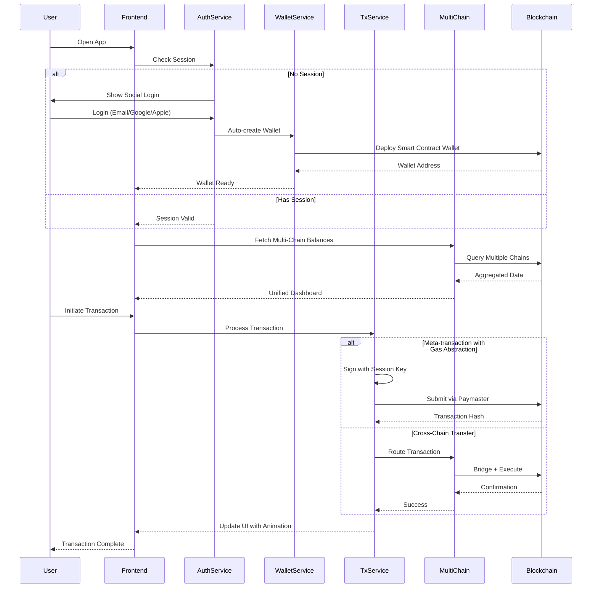

# Design Document: Advanced Web3 Wallet Features

## Overview

This design document outlines the comprehensive technical architecture for implementing 17 advanced Web3 wallet features in the Vessel crypto wallet application. The features transform a basic wallet dashboard into a sophisticated, user-friendly Web3 platform with social login, account abstraction, multi-chain support, fiat integration, AI assistance, and premium UX animations. The implementation leverages Next.js 16.1.6, React 19.2.3, TypeScript, Tailwind CSS 4, Framer Motion, and integrates with Web3 infrastructure providers for account abstraction (AA), MPC wallets, and cross-chain operations.

The design follows a modular, feature-by-feature approach where each capability is independently implementable while maintaining cohesive integration with the existing "Rise & Grind" design system (Dark Background #0A0A0A, Card Surface #18181B, Border Stroke #27272A, Neon Green #CCFF00).

## Architecture

```mermaid
graph TD
    subgraph "Frontend Layer"
        A[Next.js App Router] --> B[Feature Pages]
        B --> C[Activity Page]
        B --> D[Wallet Dashboard]
        B --> E[Payment Links]
        B --> F[Settings]
        
        G[Shared Components] --> H[Auth Components]
        G --> I[Transaction Components]
        G --> J[Animation Components]
        G --> K[AI Assistant]
    end
    
    subgraph "Service Layer"
        L[Auth Service] --> M[Social Login]
        L --> N[Wallet Creation]
        
        O[Wallet Service] --> P[MPC Provider]
        O --> Q[Smart Contract Wallet]
        
        R[Transaction Service] --> S[Meta-transactions]
        R --> T[Gas Abstraction]
        R --> U[Session Keys]
        
        V[Multi-Chain Service] --> W[Chain Router]
        V --> X[Bridge Aggregator]
        
        Y[Fiat Service] --> Z[On-Ramp Provider]
        Y --> AA[Off-Ramp Provider]
        
        AB[AI Service] --> AC[LLM API]
        AB --> AD[Intent Parser]
    end
    
    subgraph "Data Layer"
        AE[Local State] --> AF[Zustand Store]
        AG[Persistent Storage] --> AH[IndexedDB]
        AI[Backend API] --> AJ[User Profiles]
        AI --> AK[Contact Lists]
        AI --> AL[Payment Links]
    end
    
    subgraph "Blockchain Layer"
        AM[RPC Providers] --> AN[Ethereum]
        AM --> AO[Polygon]
        AM --> AP[Arbitrum]
        AM --> AQ[Base]
        
        AR[Smart Contracts] --> AS[Account Factory]
        AR --> AT[Paymaster]
        AR --> AU[Session Key Module]
    end
    
    A --> L
    A --> O
    A --> R
    A --> V
    A --> Y
    A --> AB
    
    O --> AM
    R --> AM
    V --> AM
    
    L --> AI
    O --> AI
    R --> AI
```



## Main Algorithm/Workflow



## Components and Interfaces

### Feature 1: Activity Page

**Purpose**: Comprehensive transaction history with filtering, search, and export capabilities

**Interface**:
```typescript
interface ActivityPageProps {
  userId: string;
}

interface ActivityFilter {
  chains?: string[];
  tokens?: string[];
  status?: TransactionStatus[];
  dateRange?: { start: Date; end: Date };
  minAmount?: number;
  maxAmount?: number;
}

interface ActivityTransaction extends Transaction {
  chain: string;
  chainId: number;
  blockNumber: number;
  gasUsed: string;
  gasPaidIn?: string;
  type: 'send' | 'receive' | 'swap' | 'bridge' | 'contract';
  metadata?: Record<string, any>;
}

interface ActivityPageState {
  transactions: ActivityTransaction[];
  filters: ActivityFilter;
  isLoading: boolean;
  hasMore: boolean;
  exportFormat?: 'csv' | 'json' | 'pdf';
}
```

**Responsibilities**:
- Display paginated transaction history across all chains
- Provide advanced filtering and search functionality
- Support transaction export in multiple formats
- Show detailed transaction information on click
- Integrate with existing design system animations

### Feature 2: Social Login → Auto-create Wallet

**Purpose**: Seamless onboarding via social authentication with automatic wallet provisioning

**Interface**:
```typescript
interface SocialAuthProvider {
  type: 'email' | 'google' | 'apple';
  authenticate(): Promise<AuthResult>;
  getIdToken(): Promise<string>;
}

interface AuthResult {
  userId: string;
  email: string;
  provider: string;
  idToken: string;
  expiresAt: number;
}

interface WalletCreationConfig {
  userId: string;
  provider: 'mpc' | 'smart-contract';
  recoveryMethod: 'social' | 'guardian' | 'timelock';
  initialChains: number[];
}

interface CreatedWallet {
  address: string;
  type: 'eoa' | 'smart-contract';
  deploymentTxHash?: string;
  recoveryConfig: RecoveryConfig;
  createdAt: Date;
}
```

**Responsibilities**:
- Integrate OAuth 2.0 flows for Google and Apple
- Implement magic link authentication for email
- Generate deterministic wallet addresses from social identity
- Deploy smart contract wallets on first transaction
- Store encrypted key shares for MPC wallets
- Link social identity to blockchain address

### Feature 3: MPC or Smart Contract Wallet Recovery

**Purpose**: Secure wallet recovery without seed phrases using MPC or social recovery

**Interface**:
```typescript
interface RecoveryConfig {
  method: 'mpc' | 'social-recovery' | 'timelock';
  threshold?: number;
  guardians?: string[];
  timelockPeriod?: number;
  keyShares?: KeyShareMetadata[];
}

interface KeyShareMetadata {
  shareId: string;
  provider: string;
  encryptedShare: string;
  createdAt: Date;
}

interface RecoveryRequest {
  walletAddress: string;
  userId: string;
  method: 'mpc' | 'social-recovery';
  proof: RecoveryProof;
}

interface RecoveryProof {
  socialIdToken?: string;
  guardianSignatures?: string[];
  timelockExpiry?: number;
}

interface RecoveryService {
  initiateRecovery(request: RecoveryRequest): Promise<RecoverySession>;
  verifyRecovery(sessionId: string): Promise<boolean>;
  executeRecovery(sessionId: string): Promise<string>;
}
```

**Responsibilities**:
- Implement MPC key share distribution across providers
- Support social recovery with guardian approvals
- Provide timelock-based recovery for smart contract wallets
- Secure key share encryption and storage
- Handle recovery flow UI with progress tracking

### Feature 4: Meta-transactions

**Purpose**: Enable gasless transactions where relayers pay gas fees

**Interface**:
```typescript
interface MetaTransaction {
  from: string;
  to: string;
  value: string;
  data: string;
  nonce: number;
  chainId: number;
  signature: string;
}

interface RelayerConfig {
  endpoint: string;
  apiKey: string;
  supportedChains: number[];
  maxGasPrice: string;
}

interface MetaTxService {
  signMetaTransaction(tx: Partial<MetaTransaction>): Promise<MetaTransaction>;
  submitToRelayer(metaTx: MetaTransaction): Promise<string>;
  getRelayerStatus(txHash: string): Promise<RelayerStatus>;
}

interface RelayerStatus {
  status: 'pending' | 'submitted' | 'confirmed' | 'failed';
  txHash?: string;
  blockNumber?: number;
  gasUsed?: string;
}
```

**Responsibilities**:
- Sign transactions with EIP-712 typed data
- Submit meta-transactions to relayer network
- Track relayer submission and confirmation
- Handle relayer failures with fallback options
- Integrate with paymaster contracts

### Feature 5: Pay Gas in Stablecoin

**Purpose**: Allow users to pay transaction fees in USDC/USDT instead of native tokens

**Interface**:
```typescript
interface GasPaymentConfig {
  paymentToken: string;
  paymasterAddress: string;
  exchangeRate: string;
  maxSlippage: number;
}

interface GasEstimate {
  gasLimit: string;
  gasPrice: string;
  nativeTokenCost: string;
  stablecoinCost: string;
  exchangeRate: string;
}

interface PaymasterService {
  estimateGasInStablecoin(tx: Transaction): Promise<GasEstimate>;
  approvePaymaster(token: string, amount: string): Promise<string>;
  executeWithPaymaster(tx: Transaction, payment: GasPaymentConfig): Promise<string>;
}
```

**Responsibilities**:
- Integrate with ERC-4337 paymaster contracts
- Calculate stablecoin equivalent for gas costs
- Handle token approvals for paymaster
- Execute transactions with stablecoin gas payment
- Display gas costs in user-friendly stablecoin amounts


### Feature 6: Session Keys

**Purpose**: Temporary signing keys for limited-scope transactions without repeated authentication

**Interface**:
```typescript
interface SessionKey {
  publicKey: string;
  privateKey: string;
  permissions: SessionPermissions;
  expiresAt: number;
  createdAt: number;
}

interface SessionPermissions {
  allowedContracts?: string[];
  allowedFunctions?: string[];
  spendingLimit?: string;
  timeLimit?: number;
  chainIds?: number[];
}

interface SessionKeyModule {
  createSessionKey(permissions: SessionPermissions): Promise<SessionKey>;
  revokeSessionKey(publicKey: string): Promise<void>;
  isSessionKeyValid(publicKey: string): Promise<boolean>;
  executeWithSessionKey(tx: Transaction, sessionKey: SessionKey): Promise<string>;
}
```

**Responsibilities**:
- Generate ephemeral key pairs for sessions
- Store session keys securely in browser storage
- Validate session key permissions before signing
- Automatically revoke expired session keys
- Integrate with smart contract wallet session key modules

### Feature 7: ENS / Username Mapping

**Purpose**: Human-readable names for wallet addresses with reverse resolution

**Interface**:
```typescript
interface NameService {
  resolveAddress(name: string): Promise<string | null>;
  reverseLookup(address: string): Promise<string | null>;
  registerName(name: string, address: string): Promise<string>;
  updateAvatar(name: string, avatarUrl: string): Promise<void>;
}

interface ENSProfile {
  name: string;
  address: string;
  avatar?: string;
  description?: string;
  twitter?: string;
  github?: string;
  email?: string;
}

interface UsernameCache {
  get(address: string): string | null;
  set(address: string, name: string): void;
  clear(): void;
}
```

**Responsibilities**:
- Integrate with ENS contracts for Ethereum
- Support alternative naming services (Unstoppable Domains, Lens)
- Cache resolved names for performance
- Display names instead of addresses throughout UI
- Provide name registration flow

### Feature 8: Contact List

**Purpose**: Save and manage frequently used addresses with labels

**Interface**:
```typescript
interface Contact {
  id: string;
  address: string;
  name: string;
  avatar?: string;
  ensName?: string;
  tags?: string[];
  notes?: string;
  addedAt: Date;
  lastUsed?: Date;
}

interface ContactService {
  addContact(contact: Omit<Contact, 'id' | 'addedAt'>): Promise<Contact>;
  updateContact(id: string, updates: Partial<Contact>): Promise<Contact>;
  deleteContact(id: string): Promise<void>;
  getContacts(filter?: ContactFilter): Promise<Contact[]>;
  searchContacts(query: string): Promise<Contact[]>;
}

interface ContactFilter {
  tags?: string[];
  sortBy?: 'name' | 'lastUsed' | 'addedAt';
  limit?: number;
}
```

**Responsibilities**:
- Store contacts in encrypted local storage and backend
- Sync contacts across devices
- Validate addresses before saving
- Auto-resolve ENS names for contacts
- Provide quick contact selection in send flows

### Feature 9: Multi-Chain Auto Routing

**Purpose**: Automatically route transactions through optimal chains and bridges

**Interface**:
```typescript
interface ChainRoute {
  fromChain: number;
  toChain: number;
  bridges: BridgeStep[];
  estimatedTime: number;
  estimatedCost: string;
  confidence: number;
}

interface BridgeStep {
  protocol: string;
  fromToken: string;
  toToken: string;
  amount: string;
  estimatedOutput: string;
  fee: string;
}

interface MultiChainRouter {
  findOptimalRoute(params: RouteParams): Promise<ChainRoute[]>;
  executeRoute(route: ChainRoute): Promise<RouteExecution>;
  trackRouteProgress(executionId: string): Promise<RouteProgress>;
}

interface RouteParams {
  fromChain: number;
  toChain: number;
  token: string;
  amount: string;
  recipient: string;
  priority: 'cost' | 'speed' | 'security';
}

interface RouteExecution {
  executionId: string;
  steps: ExecutionStep[];
  status: 'pending' | 'in-progress' | 'completed' | 'failed';
}

interface RouteProgress {
  currentStep: number;
  totalSteps: number;
  completedSteps: ExecutionStep[];
  estimatedCompletion: number;
}
```

**Responsibilities**:
- Integrate with bridge aggregators (Socket, LI.FI)
- Calculate optimal routes based on cost/speed/security
- Handle multi-step bridge transactions
- Track cross-chain transaction status
- Provide fallback routes on failure

### Feature 10: Fiat On-Ramp + Off-Ramp Integrated

**Purpose**: Buy crypto with fiat and sell crypto for fiat within the app

**Interface**:
```typescript
interface FiatProvider {
  name: string;
  type: 'on-ramp' | 'off-ramp' | 'both';
  supportedCurrencies: string[];
  supportedCryptos: string[];
  limits: FiatLimits;
}

interface FiatLimits {
  minAmount: number;
  maxAmount: number;
  dailyLimit: number;
  monthlyLimit: number;
}

interface OnRampRequest {
  fiatAmount: number;
  fiatCurrency: string;
  cryptoCurrency: string;
  destinationAddress: string;
  paymentMethod: 'card' | 'bank' | 'apple-pay' | 'google-pay';
}

interface OffRampRequest {
  cryptoAmount: string;
  cryptoCurrency: string;
  fiatCurrency: string;
  bankAccount: BankAccountInfo;
}

interface FiatService {
  getProviders(): Promise<FiatProvider[]>;
  initiateOnRamp(request: OnRampRequest): Promise<FiatSession>;
  initiateOffRamp(request: OffRampRequest): Promise<FiatSession>;
  getSessionStatus(sessionId: string): Promise<FiatSessionStatus>;
}

interface FiatSession {
  sessionId: string;
  provider: string;
  widgetUrl?: string;
  status: 'pending' | 'processing' | 'completed' | 'failed';
}
```

**Responsibilities**:
- Integrate with fiat providers (Moonpay, Transak, Ramp)
- Embed provider widgets in app
- Handle KYC requirements
- Track fiat transaction status
- Display fiat balances alongside crypto

### Feature 11: Unified Asset Dashboard

**Purpose**: Single view of all assets across chains including tokens, NFTs, and DeFi positions

**Interface**:
```typescript
interface UnifiedAsset {
  type: 'token' | 'nft' | 'defi-position';
  chain: string;
  chainId: number;
  value: string;
  metadata: TokenMetadata | NFTMetadata | DeFiMetadata;
}

interface TokenMetadata {
  address: string;
  symbol: string;
  name: string;
  decimals: number;
  balance: string;
  price: number;
  priceChange24h: number;
  logo?: string;
}

interface NFTMetadata {
  contractAddress: string;
  tokenId: string;
  name: string;
  description?: string;
  image: string;
  collection: string;
  floorPrice?: number;
}

interface DeFiMetadata {
  protocol: string;
  type: 'lending' | 'staking' | 'liquidity' | 'farming';
  deposited: string;
  earned: string;
  apy: number;
  claimable?: string;
}

interface PendingTransaction {
  hash: string;
  chain: number;
  type: string;
  status: 'pending' | 'confirming';
  submittedAt: number;
  confirmations: number;
  requiredConfirmations: number;
}

interface AssetDashboard {
  totalValue: string;
  tokens: UnifiedAsset[];
  nfts: UnifiedAsset[];
  defiPositions: UnifiedAsset[];
  pendingTransactions: PendingTransaction[];
  lastUpdated: Date;
}
```

**Responsibilities**:
- Aggregate data from multiple chains
- Fetch token balances and prices
- Query NFT ownership across chains
- Detect DeFi positions (Aave, Compound, Uniswap)
- Display pending transactions with status
- Calculate total portfolio value


### Feature 12: Payment Links (Stripe-style Web3)

**Purpose**: Create shareable payment links that accept multiple tokens with auto-conversion

**Interface**:
```typescript
interface PaymentLink {
  id: string;
  creatorAddress: string;
  amount: string;
  currency: 'USD' | 'EUR' | 'GBP';
  acceptedTokens: string[];
  autoConvertTo?: string;
  description: string;
  expiresAt?: Date;
  maxUses?: number;
  currentUses: number;
  status: 'active' | 'expired' | 'completed';
  createdAt: Date;
}

interface PaymentLinkConfig {
  amount: string;
  currency: string;
  acceptedTokens: string[];
  autoConvertTo?: string;
  description: string;
  expiresIn?: number;
  maxUses?: number;
  successUrl?: string;
  cancelUrl?: string;
}

interface PaymentLinkService {
  createPaymentLink(config: PaymentLinkConfig): Promise<PaymentLink>;
  getPaymentLink(id: string): Promise<PaymentLink>;
  payWithLink(linkId: string, payment: PaymentDetails): Promise<string>;
  getPaymentHistory(linkId: string): Promise<Payment[]>;
}

interface PaymentDetails {
  payerAddress: string;
  token: string;
  amount: string;
  chain: number;
}

interface Payment {
  id: string;
  linkId: string;
  payerAddress: string;
  token: string;
  amount: string;
  convertedAmount?: string;
  txHash: string;
  paidAt: Date;
}
```

**Responsibilities**:
- Generate unique shareable payment URLs
- Accept payments in multiple tokens
- Auto-convert received tokens to stablecoin
- Track payment status and history
- Provide embeddable payment widgets
- Send payment notifications

### Feature 13: AI Payment Assistant

**Purpose**: Natural language interface for transaction intents and wallet operations

**Interface**:
```typescript
interface AIAssistant {
  parseIntent(userInput: string): Promise<TransactionIntent>;
  suggestActions(context: WalletContext): Promise<ActionSuggestion[]>;
  explainTransaction(tx: Transaction): Promise<string>;
  answerQuestion(question: string, context: WalletContext): Promise<string>;
}

interface TransactionIntent {
  type: 'send' | 'swap' | 'bridge' | 'stake' | 'unknown';
  confidence: number;
  parameters: IntentParameters;
  clarificationNeeded?: string[];
}

interface IntentParameters {
  recipient?: string;
  amount?: string;
  token?: string;
  fromChain?: number;
  toChain?: number;
  protocol?: string;
}

interface ActionSuggestion {
  title: string;
  description: string;
  action: () => Promise<void>;
  priority: number;
  category: 'optimization' | 'security' | 'opportunity';
}

interface WalletContext {
  address: string;
  balances: UnifiedAsset[];
  recentTransactions: Transaction[];
  activeChains: number[];
}
```

**Responsibilities**:
- Parse natural language transaction requests
- Extract transaction parameters from user input
- Suggest gas optimizations and better routes
- Explain complex transactions in simple terms
- Provide proactive wallet management tips
- Integrate with LLM API (OpenAI, Anthropic)

### Feature 14: Transaction Timeline Animation

**Purpose**: Visual animated timeline showing transaction lifecycle and status

**Interface**:
```typescript
interface TransactionTimeline {
  txHash: string;
  stages: TimelineStage[];
  currentStage: number;
  estimatedCompletion: number;
}

interface TimelineStage {
  name: string;
  status: 'pending' | 'in-progress' | 'completed' | 'failed';
  timestamp?: Date;
  description: string;
  icon: string;
  metadata?: Record<string, any>;
}

interface TimelineAnimationConfig {
  duration: number;
  easing: string;
  particleEffect: boolean;
  soundEnabled: boolean;
}

interface TransactionTimelineComponent {
  timeline: TransactionTimeline;
  animationConfig: TimelineAnimationConfig;
  onStageComplete?: (stage: number) => void;
  onComplete?: () => void;
}
```

**Responsibilities**:
- Display transaction stages (signing, broadcasting, confirming)
- Animate transitions between stages
- Show real-time progress updates
- Handle cross-chain transaction stages
- Integrate with Framer Motion for smooth animations
- Provide haptic feedback on mobile

### Feature 15: Visual Gas Estimator Slider

**Purpose**: Interactive slider to adjust gas price with visual cost/speed tradeoffs

**Interface**:
```typescript
interface GasEstimatorConfig {
  minGasPrice: string;
  maxGasPrice: string;
  currentGasPrice: string;
  baseFee?: string;
  priorityFee?: string;
}

interface GasOption {
  label: 'slow' | 'standard' | 'fast' | 'instant';
  gasPrice: string;
  estimatedTime: number;
  cost: string;
  probability: number;
}

interface GasEstimatorSlider {
  options: GasOption[];
  selectedOption: GasOption;
  customGasPrice?: string;
  onGasChange: (option: GasOption) => void;
}

interface GasEstimatorService {
  getCurrentGasPrices(chainId: number): Promise<GasEstimatorConfig>;
  estimateConfirmationTime(gasPrice: string, chainId: number): Promise<number>;
  calculateCost(gasLimit: string, gasPrice: string, token?: string): Promise<string>;
}
```

**Responsibilities**:
- Fetch real-time gas prices from chain
- Calculate cost in native token and USD
- Estimate confirmation time for each gas level
- Provide visual slider with color-coded options
- Support EIP-1559 base fee + priority fee
- Allow custom gas price input

### Feature 16: Address Identity Cards

**Purpose**: Rich visual cards showing address information, ENS, avatar, and reputation

**Interface**:
```typescript
interface AddressIdentity {
  address: string;
  ensName?: string;
  avatar?: string;
  labels: string[];
  reputation?: ReputationScore;
  socialProfiles?: SocialProfile[];
  firstSeen?: Date;
  transactionCount?: number;
}

interface ReputationScore {
  score: number;
  level: 'new' | 'active' | 'trusted' | 'verified';
  badges: string[];
  verifications: Verification[];
}

interface Verification {
  type: 'twitter' | 'github' | 'discord' | 'kyc';
  verified: boolean;
  verifiedAt?: Date;
}

interface SocialProfile {
  platform: string;
  username: string;
  url: string;
}

interface AddressIdentityService {
  getIdentity(address: string): Promise<AddressIdentity>;
  resolveMultipleIdentities(addresses: string[]): Promise<Map<string, AddressIdentity>>;
  updateIdentity(address: string, updates: Partial<AddressIdentity>): Promise<void>;
}
```

**Responsibilities**:
- Fetch ENS names and avatars
- Query address labels from Etherscan/block explorers
- Calculate reputation scores based on activity
- Display social verifications
- Show address risk indicators
- Provide visual identity cards in transaction flows

### Feature 17: Cross-Chain Transfer Map Animation

**Purpose**: Animated visualization of cross-chain transfers showing route and progress

**Interface**:
```typescript
interface ChainNode {
  chainId: number;
  name: string;
  logo: string;
  position: { x: number; y: number };
  color: string;
}

interface TransferRoute {
  fromChain: ChainNode;
  toChain: ChainNode;
  intermediateChains?: ChainNode[];
  amount: string;
  token: string;
  status: 'pending' | 'bridging' | 'completed';
}

interface MapAnimationConfig {
  showParticles: boolean;
  particleColor: string;
  routeColor: string;
  animationSpeed: number;
  glowEffect: boolean;
}

interface CrossChainMapComponent {
  routes: TransferRoute[];
  activeRoute?: TransferRoute;
  animationConfig: MapAnimationConfig;
  onChainClick?: (chain: ChainNode) => void;
}

interface MapAnimationService {
  calculateChainPositions(chains: number[]): Map<number, { x: number; y: number }>;
  animateTransfer(route: TransferRoute): Promise<void>;
  updateRouteProgress(routeId: string, progress: number): void;
}
```

**Responsibilities**:
- Display interactive chain network map
- Animate token flow between chains
- Show real-time transfer progress
- Highlight active routes with particles
- Integrate with GSAP for complex animations
- Support zoom and pan interactions


## Data Models

### User Profile Model

```typescript
interface UserProfile {
  id: string;
  email?: string;
  socialProvider?: 'google' | 'apple' | 'email';
  walletAddress: string;
  walletType: 'eoa' | 'smart-contract' | 'mpc';
  createdAt: Date;
  lastLoginAt: Date;
  preferences: UserPreferences;
  recoveryConfig: RecoveryConfig;
}

interface UserPreferences {
  defaultChain: number;
  defaultToken: string;
  gasPreference: 'slow' | 'standard' | 'fast';
  enableNotifications: boolean;
  enableHaptics: boolean;
  theme: 'dark' | 'light';
  currency: 'USD' | 'EUR' | 'GBP';
}
```

**Validation Rules**:
- `email` must be valid email format if provided
- `walletAddress` must be valid Ethereum address (0x + 40 hex chars)
- `defaultChain` must be supported chain ID
- `createdAt` and `lastLoginAt` must be valid timestamps

### Transaction Model

```typescript
interface EnhancedTransaction {
  id: string;
  hash: string;
  from: string;
  to: string;
  value: string;
  token?: string;
  chainId: number;
  blockNumber?: number;
  timestamp: Date;
  status: 'pending' | 'confirming' | 'completed' | 'failed';
  type: 'send' | 'receive' | 'swap' | 'bridge' | 'contract';
  gasUsed?: string;
  gasPaidIn?: string;
  gasCostUSD?: string;
  metadata: TransactionMetadata;
}

interface TransactionMetadata {
  isMetaTx: boolean;
  usedSessionKey: boolean;
  paymasterAddress?: string;
  bridgeProtocol?: string;
  swapProtocol?: string;
  nftTransfer?: NFTTransferInfo;
  contractInteraction?: ContractInteractionInfo;
}

interface NFTTransferInfo {
  contractAddress: string;
  tokenId: string;
  name: string;
  image: string;
}

interface ContractInteractionInfo {
  contractAddress: string;
  functionName: string;
  parameters: any[];
}
```

**Validation Rules**:
- `hash` must be valid transaction hash (0x + 64 hex chars)
- `from` and `to` must be valid addresses
- `value` must be non-negative numeric string
- `chainId` must be supported chain
- `status` transitions: pending → confirming → completed/failed

### Contact Model

```typescript
interface ContactModel {
  id: string;
  userId: string;
  address: string;
  name: string;
  avatar?: string;
  ensName?: string;
  tags: string[];
  notes?: string;
  addedAt: Date;
  lastUsed?: Date;
  transactionCount: number;
  totalVolume: string;
}
```

**Validation Rules**:
- `address` must be valid Ethereum address
- `name` must be 1-50 characters
- `tags` array max 10 items, each 1-20 characters
- `notes` max 500 characters
- `transactionCount` must be non-negative integer

### Payment Link Model

```typescript
interface PaymentLinkModel {
  id: string;
  creatorAddress: string;
  amount: string;
  currency: string;
  acceptedTokens: string[];
  autoConvertTo?: string;
  description: string;
  expiresAt?: Date;
  maxUses?: number;
  currentUses: number;
  status: 'active' | 'expired' | 'completed';
  createdAt: Date;
  payments: PaymentRecord[];
}

interface PaymentRecord {
  id: string;
  payerAddress: string;
  token: string;
  amount: string;
  convertedAmount?: string;
  txHash: string;
  chainId: number;
  paidAt: Date;
}
```

**Validation Rules**:
- `amount` must be positive numeric string
- `currency` must be supported fiat currency
- `acceptedTokens` must contain at least one valid token address
- `maxUses` must be positive integer if provided
- `currentUses` must not exceed `maxUses`
- `expiresAt` must be future date if provided

## Algorithmic Pseudocode

### Main Processing Algorithm: Multi-Chain Balance Aggregation

```typescript
async function aggregateMultiChainBalances(
  address: string,
  chains: number[]
): Promise<AssetDashboard> {
  // Preconditions:
  // - address is valid Ethereum address
  // - chains array contains supported chain IDs
  // - RPC providers are configured for all chains
  
  const results: UnifiedAsset[] = [];
  const pendingTxs: PendingTransaction[] = [];
  
  // Parallel fetch across all chains
  const chainPromises = chains.map(async (chainId) => {
    const provider = getRPCProvider(chainId);
    
    // Fetch native token balance
    const nativeBalance = await provider.getBalance(address);
    if (nativeBalance > 0) {
      const nativeAsset = await createNativeAsset(chainId, nativeBalance);
      results.push(nativeAsset);
    }
    
    // Fetch ERC-20 token balances
    const tokens = await getTokensForChain(chainId);
    const tokenBalances = await Promise.all(
      tokens.map(token => getTokenBalance(address, token, provider))
    );
    
    tokenBalances.forEach((balance, idx) => {
      if (balance > 0) {
        results.push(createTokenAsset(tokens[idx], balance, chainId));
      }
    });
    
    // Fetch NFTs
    const nfts = await getNFTsForAddress(address, chainId);
    results.push(...nfts.map(nft => createNFTAsset(nft, chainId)));
    
    // Fetch DeFi positions
    const defiPositions = await getDeFiPositions(address, chainId);
    results.push(...defiPositions.map(pos => createDeFiAsset(pos, chainId)));
    
    // Fetch pending transactions
    const pending = await getPendingTransactions(address, chainId);
    pendingTxs.push(...pending);
  });
  
  await Promise.all(chainPromises);
  
  // Calculate total value in USD
  const totalValue = results.reduce((sum, asset) => {
    return sum + parseFloat(asset.value);
  }, 0);
  
  // Postconditions:
  // - All assets have valid chain IDs
  // - Total value is sum of all asset values
  // - Pending transactions are from specified chains
  
  return {
    totalValue: totalValue.toString(),
    tokens: results.filter(a => a.type === 'token'),
    nfts: results.filter(a => a.type === 'nft'),
    defiPositions: results.filter(a => a.type === 'defi-position'),
    pendingTransactions: pendingTxs,
    lastUpdated: new Date()
  };
}
```

**Preconditions:**
- `address` is a valid Ethereum address (checksummed)
- `chains` array is non-empty and contains only supported chain IDs
- RPC providers are initialized and responsive
- Token list is loaded for each chain

**Postconditions:**
- Returns `AssetDashboard` with all assets across chains
- `totalValue` equals sum of all individual asset values
- All assets have valid `chainId` matching input chains
- `lastUpdated` is current timestamp
- No duplicate assets in results

**Loop Invariants:**
- Each chain is processed exactly once
- All fetched balances are non-negative
- Asset types are correctly categorized

### Algorithm: Social Login with Auto Wallet Creation

```typescript
async function socialLoginAndCreateWallet(
  provider: 'google' | 'apple' | 'email',
  credential: string
): Promise<{ user: UserProfile; wallet: CreatedWallet }> {
  // Preconditions:
  // - provider is one of supported types
  // - credential is valid OAuth token or email
  
  // Step 1: Authenticate with social provider
  const authResult = await authenticateWithProvider(provider, credential);
  
  if (!authResult.success) {
    throw new Error('Authentication failed');
  }
  
  // Step 2: Check if user already exists
  let user = await getUserByProviderId(authResult.userId, provider);
  
  if (user && user.walletAddress) {
    // User exists with wallet, return existing
    const wallet = await getWalletInfo(user.walletAddress);
    return { user, wallet };
  }
  
  // Step 3: Generate deterministic wallet address
  const walletSeed = deriveWalletSeed(authResult.userId, provider);
  const walletAddress = await generateWalletAddress(walletSeed);
  
  // Step 4: Create MPC key shares or prepare smart contract wallet
  let wallet: CreatedWallet;
  
  if (USE_MPC_WALLET) {
    // MPC approach: distribute key shares
    const keyShares = await generateMPCKeyShares(walletSeed, 3, 2);
    await distributeKeyShares(keyShares, authResult.userId);
    
    wallet = {
      address: walletAddress,
      type: 'eoa',
      recoveryConfig: {
        method: 'mpc',
        threshold: 2,
        keyShares: keyShares.map(share => ({
          shareId: share.id,
          provider: share.provider,
          encryptedShare: share.encrypted,
          createdAt: new Date()
        }))
      },
      createdAt: new Date()
    };
  } else {
    // Smart contract wallet approach
    wallet = {
      address: walletAddress,
      type: 'smart-contract',
      recoveryConfig: {
        method: 'social-recovery',
        guardians: [], // To be set by user later
        threshold: 1
      },
      createdAt: new Date()
    };
  }
  
  // Step 5: Create or update user profile
  if (!user) {
    user = await createUserProfile({
      id: authResult.userId,
      email: authResult.email,
      socialProvider: provider,
      walletAddress: wallet.address,
      walletType: wallet.type,
      createdAt: new Date(),
      lastLoginAt: new Date(),
      preferences: getDefaultPreferences(),
      recoveryConfig: wallet.recoveryConfig
    });
  } else {
    user = await updateUserProfile(user.id, {
      walletAddress: wallet.address,
      walletType: wallet.type,
      lastLoginAt: new Date(),
      recoveryConfig: wallet.recoveryConfig
    });
  }
  
  // Postconditions:
  // - User profile exists with wallet address
  // - Wallet is created (MPC shares distributed or SC wallet prepared)
  // - Recovery config is properly set
  
  return { user, wallet };
}
```

**Preconditions:**
- `provider` is one of: 'google', 'apple', 'email'
- `credential` is valid OAuth token or email verification code
- MPC providers or smart contract factory is available
- Database connection is active

**Postconditions:**
- Returns user profile with wallet address
- Wallet is created with appropriate type (EOA for MPC, smart-contract for AA)
- Recovery configuration is initialized
- User can immediately use wallet for transactions
- Key shares are securely distributed (if MPC)

**Loop Invariants:**
- N/A (no loops in main flow)


### Algorithm: Cross-Chain Transaction Routing

```typescript
async function routeCrossChainTransaction(
  params: RouteParams
): Promise<RouteExecution> {
  // Preconditions:
  // - fromChain and toChain are different and supported
  // - token exists on fromChain
  // - amount is positive and user has sufficient balance
  // - recipient is valid address
  
  // Step 1: Find all possible routes
  const routes = await findAllRoutes(params);
  
  if (routes.length === 0) {
    throw new Error('No routes available for this transfer');
  }
  
  // Step 2: Score and rank routes based on priority
  const scoredRoutes = routes.map(route => ({
    route,
    score: calculateRouteScore(route, params.priority)
  }));
  
  scoredRoutes.sort((a, b) => b.score - a.score);
  const optimalRoute = scoredRoutes[0].route;
  
  // Step 3: Prepare execution steps
  const steps: ExecutionStep[] = [];
  
  for (let i = 0; i < optimalRoute.bridges.length; i++) {
    const bridge = optimalRoute.bridges[i];
    
    // Approve token if needed
    if (i === 0) {
      const approvalStep = await prepareApprovalStep(
        bridge.fromToken,
        bridge.protocol,
        bridge.amount
      );
      if (approvalStep) {
        steps.push(approvalStep);
      }
    }
    
    // Bridge step
    const bridgeStep = await prepareBridgeStep(bridge, params.recipient);
    steps.push(bridgeStep);
  }
  
  // Step 4: Execute steps sequentially
  const executionId = generateExecutionId();
  const execution: RouteExecution = {
    executionId,
    steps,
    status: 'pending'
  };
  
  // Start execution asynchronously
  executeStepsSequentially(execution, steps).catch(error => {
    updateExecutionStatus(executionId, 'failed', error);
  });
  
  // Postconditions:
  // - Execution object created with unique ID
  // - Steps are prepared and ready to execute
  // - Execution started asynchronously
  
  return execution;
}

async function executeStepsSequentially(
  execution: RouteExecution,
  steps: ExecutionStep[]
): Promise<void> {
  // Loop invariant: All previous steps are completed successfully
  
  execution.status = 'in-progress';
  
  for (let i = 0; i < steps.length; i++) {
    const step = steps[i];
    
    try {
      step.status = 'executing';
      
      // Execute the step
      const txHash = await executeStep(step);
      
      // Wait for confirmation
      await waitForConfirmation(txHash, step.chainId);
      
      step.status = 'completed';
      step.txHash = txHash;
      step.completedAt = new Date();
      
      // Notify progress
      notifyStepComplete(execution.executionId, i, steps.length);
      
    } catch (error) {
      step.status = 'failed';
      step.error = error.message;
      execution.status = 'failed';
      throw error;
    }
  }
  
  execution.status = 'completed';
  notifyExecutionComplete(execution.executionId);
}
```

**Preconditions:**
- `fromChain` and `toChain` are different chain IDs
- Both chains are supported by the router
- `token` exists on `fromChain` with sufficient balance
- `amount` is positive numeric string
- `recipient` is valid address on `toChain`
- User has approved spending or will approve in first step

**Postconditions:**
- Returns `RouteExecution` with unique execution ID
- All steps are prepared with correct parameters
- Execution is initiated asynchronously
- Progress notifications are sent for each step
- Final status is either 'completed' or 'failed'

**Loop Invariants:**
- In `executeStepsSequentially`: All steps before index `i` are completed
- Each step transitions: pending → executing → completed/failed
- Transaction hashes are recorded for completed steps
- Execution stops on first failure

### Algorithm: AI Intent Parsing

```typescript
async function parseTransactionIntent(
  userInput: string,
  context: WalletContext
): Promise<TransactionIntent> {
  // Preconditions:
  // - userInput is non-empty string
  // - context contains valid wallet data
  // - LLM API is available
  
  // Step 1: Preprocess input
  const normalizedInput = normalizeInput(userInput);
  
  // Step 2: Extract entities using NLP
  const entities = await extractEntities(normalizedInput);
  
  // Step 3: Build prompt for LLM
  const prompt = buildIntentPrompt(normalizedInput, entities, context);
  
  // Step 4: Call LLM API
  const llmResponse = await callLLM(prompt);
  
  // Step 5: Parse LLM response
  const parsedIntent = parseIntentFromLLM(llmResponse);
  
  // Step 6: Validate and enrich intent
  const validatedIntent = await validateIntent(parsedIntent, context);
  
  // Step 7: Calculate confidence score
  const confidence = calculateConfidence(
    entities,
    parsedIntent,
    validatedIntent
  );
  
  // Step 8: Identify missing parameters
  const clarificationNeeded = identifyMissingParams(validatedIntent);
  
  const intent: TransactionIntent = {
    type: validatedIntent.type,
    confidence,
    parameters: validatedIntent.parameters,
    clarificationNeeded: clarificationNeeded.length > 0 ? clarificationNeeded : undefined
  };
  
  // Postconditions:
  // - Intent type is determined
  // - Confidence score is between 0 and 1
  // - Parameters are extracted where possible
  // - Missing parameters are identified
  
  return intent;
}

function buildIntentPrompt(
  input: string,
  entities: ExtractedEntity[],
  context: WalletContext
): string {
  return `
You are a Web3 wallet assistant. Parse the user's transaction intent.

User input: "${input}"

Extracted entities: ${JSON.stringify(entities)}

Wallet context:
- Address: ${context.address}
- Available tokens: ${context.balances.map(b => b.metadata.symbol).join(', ')}
- Active chains: ${context.activeChains.join(', ')}

Determine:
1. Transaction type (send, swap, bridge, stake, or unknown)
2. Recipient address (if applicable)
3. Amount and token
4. Source and destination chains (if applicable)
5. Any missing information needed

Respond in JSON format:
{
  "type": "send|swap|bridge|stake|unknown",
  "parameters": {
    "recipient": "address or null",
    "amount": "number or null",
    "token": "symbol or null",
    "fromChain": "chain name or null",
    "toChain": "chain name or null"
  },
  "missing": ["list of missing parameters"]
}
`;
}
```

**Preconditions:**
- `userInput` is non-empty string (1-500 characters)
- `context.address` is valid wallet address
- `context.balances` contains current token balances
- LLM API key is configured and valid
- Network connection is available

**Postconditions:**
- Returns `TransactionIntent` with determined type
- `confidence` is float between 0.0 and 1.0
- `parameters` contains all extractable information
- `clarificationNeeded` lists missing required parameters
- Intent type is 'unknown' if confidence < 0.5

**Loop Invariants:**
- N/A (no loops in main flow)

## Key Functions with Formal Specifications

### Function: createSessionKey()

```typescript
async function createSessionKey(
  permissions: SessionPermissions
): Promise<SessionKey>
```

**Preconditions:**
- `permissions.spendingLimit` is positive if provided
- `permissions.timeLimit` is positive if provided
- `permissions.allowedContracts` contains valid addresses if provided
- `permissions.chainIds` contains supported chains if provided

**Postconditions:**
- Returns `SessionKey` with generated key pair
- `privateKey` is securely generated (256-bit entropy)
- `expiresAt` is current time + `timeLimit` (or default 24h)
- Session key is stored in secure storage
- Session key is registered with smart contract wallet module

### Function: executeWithPaymaster()

```typescript
async function executeWithPaymaster(
  tx: Transaction,
  payment: GasPaymentConfig
): Promise<string>
```

**Preconditions:**
- `tx` is valid transaction object
- `payment.paymentToken` has sufficient balance
- `payment.paymasterAddress` is valid and funded
- User has approved paymaster to spend payment token
- Exchange rate is recent (< 5 minutes old)

**Postconditions:**
- Returns transaction hash
- Transaction is submitted to blockchain
- Gas is paid in specified stablecoin
- User's stablecoin balance is decreased by gas cost
- Paymaster's native token balance is decreased

### Function: resolveENSName()

```typescript
async function resolveENSName(name: string): Promise<string | null>
```

**Preconditions:**
- `name` ends with valid TLD (.eth, .xyz, etc.)
- ENS resolver contract is accessible
- RPC provider is connected

**Postconditions:**
- Returns Ethereum address if name is registered
- Returns null if name is not registered or expired
- Result is cached for 5 minutes
- Reverse resolution is also cached

### Function: createPaymentLink()

```typescript
async function createPaymentLink(
  config: PaymentLinkConfig
): Promise<PaymentLink>
```

**Preconditions:**
- `config.amount` is positive numeric string
- `config.acceptedTokens` is non-empty array
- `config.expiresIn` is positive if provided
- `config.maxUses` is positive if provided
- Creator has valid wallet address

**Postconditions:**
- Returns `PaymentLink` with unique ID
- Link is stored in database
- Link URL is shareable: `https://app.vessel.com/pay/{id}`
- Link status is 'active'
- `currentUses` is 0


## Example Usage

### Example 1: Social Login and First Transaction

```typescript
// User clicks "Sign in with Google"
const authResult = await socialLoginAndCreateWallet('google', googleToken);

console.log('Wallet created:', authResult.wallet.address);
console.log('Wallet type:', authResult.wallet.type);

// User wants to send USDC to a friend
const recipient = await resolveENSName('friend.eth');

// Create session key for this transaction
const sessionKey = await createSessionKey({
  allowedContracts: [USDC_ADDRESS],
  spendingLimit: '100',
  timeLimit: 3600, // 1 hour
  chainIds: [1, 137] // Ethereum and Polygon
});

// Estimate gas in stablecoin
const gasEstimate = await estimateGasInStablecoin({
  to: recipient,
  value: '0',
  data: encodeTransfer(recipient, '50')
});

console.log('Gas cost:', gasEstimate.stablecoinCost, 'USDC');

// Execute with paymaster (gas paid in USDC)
const txHash = await executeWithPaymaster(
  {
    to: USDC_ADDRESS,
    data: encodeTransfer(recipient, '50'),
    chainId: 137
  },
  {
    paymentToken: USDC_ADDRESS,
    paymasterAddress: PAYMASTER_ADDRESS,
    exchangeRate: gasEstimate.exchangeRate,
    maxSlippage: 0.01
  }
);

console.log('Transaction submitted:', txHash);
```

### Example 2: Cross-Chain Transfer with AI Assistant

```typescript
// User types: "Send 100 USDC to alice.eth on Arbitrum"
const intent = await parseTransactionIntent(
  "Send 100 USDC to alice.eth on Arbitrum",
  walletContext
);

console.log('Intent:', intent);
// {
//   type: 'bridge',
//   confidence: 0.95,
//   parameters: {
//     recipient: 'alice.eth',
//     amount: '100',
//     token: 'USDC',
//     fromChain: 1, // Current chain (Ethereum)
//     toChain: 42161 // Arbitrum
//   }
// }

// Find optimal route
const routes = await findOptimalRoute({
  fromChain: 1,
  toChain: 42161,
  token: USDC_ADDRESS,
  amount: '100',
  recipient: await resolveENSName('alice.eth'),
  priority: 'cost'
});

console.log('Best route:', routes[0]);
// {
//   fromChain: 1,
//   toChain: 42161,
//   bridges: [{ protocol: 'Across', fee: '0.05', estimatedTime: 180 }],
//   estimatedCost: '0.05 USDC',
//   confidence: 0.98
// }

// Execute route with animation
const execution = await routeCrossChainTransaction({
  fromChain: 1,
  toChain: 42161,
  token: USDC_ADDRESS,
  amount: '100',
  recipient: await resolveENSName('alice.eth'),
  priority: 'cost'
});

// Track progress with animated map
trackRouteProgress(execution.executionId, (progress) => {
  console.log(`Step ${progress.currentStep}/${progress.totalSteps}`);
  updateCrossChainMapAnimation(progress);
});
```

### Example 3: Create Payment Link

```typescript
// Merchant creates payment link for $50
const paymentLink = await createPaymentLink({
  amount: '50',
  currency: 'USD',
  acceptedTokens: [USDC_ADDRESS, USDT_ADDRESS, DAI_ADDRESS],
  autoConvertTo: USDC_ADDRESS,
  description: 'Premium Subscription - Monthly',
  expiresIn: 86400 * 7, // 7 days
  maxUses: 1,
  successUrl: 'https://myapp.com/success',
  cancelUrl: 'https://myapp.com/cancel'
});

console.log('Payment link:', `https://vessel.com/pay/${paymentLink.id}`);

// Customer pays with USDT
const payment = await payWithLink(paymentLink.id, {
  payerAddress: customerAddress,
  token: USDT_ADDRESS,
  amount: '50',
  chain: 137
});

console.log('Payment successful:', payment.txHash);
console.log('Auto-converted to USDC:', payment.convertedAmount);
```

### Example 4: Unified Dashboard with Activity

```typescript
// Fetch all assets across chains
const dashboard = await aggregateMultiChainBalances(
  userAddress,
  [1, 137, 42161, 8453] // Ethereum, Polygon, Arbitrum, Base
);

console.log('Total portfolio value:', dashboard.totalValue, 'USD');
console.log('Tokens:', dashboard.tokens.length);
console.log('NFTs:', dashboard.nfts.length);
console.log('DeFi positions:', dashboard.defiPositions.length);
console.log('Pending transactions:', dashboard.pendingTransactions.length);

// Display in UI with animations
dashboard.tokens.forEach((token, index) => {
  animateTokenCard(token, index * 100); // Stagger animation
});

// Fetch activity with filters
const activity = await getActivity({
  userId: user.id,
  filters: {
    chains: [137, 42161],
    status: ['completed'],
    dateRange: {
      start: new Date('2024-01-01'),
      end: new Date()
    }
  },
  page: 1,
  limit: 20
});

console.log('Activity:', activity.transactions.length, 'transactions');
```

### Example 5: Gas Estimator with Visual Slider

```typescript
// Get current gas prices
const gasConfig = await getCurrentGasPrices(1); // Ethereum

console.log('Base fee:', gasConfig.baseFee);
console.log('Priority fee:', gasConfig.priorityFee);

// Calculate options for slider
const gasOptions: GasOption[] = [
  {
    label: 'slow',
    gasPrice: gasConfig.baseFee,
    estimatedTime: 300, // 5 minutes
    cost: '2.50',
    probability: 0.85
  },
  {
    label: 'standard',
    gasPrice: (parseFloat(gasConfig.baseFee) * 1.2).toString(),
    estimatedTime: 60, // 1 minute
    cost: '3.00',
    probability: 0.95
  },
  {
    label: 'fast',
    gasPrice: (parseFloat(gasConfig.baseFee) * 1.5).toString(),
    estimatedTime: 15, // 15 seconds
    cost: '3.75',
    probability: 0.99
  }
];

// User selects gas option via slider
const selectedGas = gasOptions[1]; // Standard

// Execute transaction with selected gas
const tx = await sendTransaction({
  to: recipient,
  value: amount,
  gasPrice: selectedGas.gasPrice
});
```

## Correctness Properties

### Property 1: Balance Consistency
```typescript
// For all transactions, the sum of balances before and after must be conserved
∀ tx: Transaction, 
  balance_before(tx.from) - tx.value - tx.gasCost = balance_after(tx.from) ∧
  balance_before(tx.to) + tx.value = balance_after(tx.to)
```

### Property 2: Session Key Expiration
```typescript
// Session keys must not be usable after expiration
∀ sessionKey: SessionKey,
  currentTime > sessionKey.expiresAt ⟹ 
  executeWithSessionKey(tx, sessionKey) throws Error
```

### Property 3: Payment Link Usage Limits
```typescript
// Payment links cannot exceed max uses
∀ link: PaymentLink,
  link.maxUses ≠ null ⟹ 
  link.currentUses ≤ link.maxUses ∧
  (link.currentUses = link.maxUses ⟹ link.status = 'completed')
```

### Property 4: Cross-Chain Route Validity
```typescript
// All routes must have valid bridge steps
∀ route: ChainRoute,
  route.fromChain ≠ route.toChain ∧
  route.bridges.length > 0 ∧
  ∀ bridge ∈ route.bridges,
    isSupportedBridge(bridge.protocol) ∧
    bridge.fee ≥ 0
```

### Property 5: Gas Payment Conservation
```typescript
// When paying gas in stablecoin, the exchange must be fair
∀ tx: Transaction with paymaster,
  stablecoinPaid = nativeGasCost * exchangeRate * (1 + slippage) ∧
  slippage ≤ maxSlippage
```

### Property 6: Social Recovery Threshold
```typescript
// Social recovery requires threshold signatures
∀ recovery: RecoveryRequest where method = 'social-recovery',
  recovery.proof.guardianSignatures.length ≥ recovery.config.threshold ∧
  ∀ sig ∈ recovery.proof.guardianSignatures,
    isValidGuardian(sig.signer, recovery.walletAddress)
```

### Property 7: Multi-Chain Balance Aggregation
```typescript
// Total value equals sum of all asset values
∀ dashboard: AssetDashboard,
  dashboard.totalValue = 
    sum(dashboard.tokens.map(t => t.value)) +
    sum(dashboard.nfts.map(n => n.value)) +
    sum(dashboard.defiPositions.map(d => d.value))
```

### Property 8: Transaction Status Transitions
```typescript
// Transaction status must follow valid state machine
∀ tx: Transaction,
  (tx.status = 'pending' ⟹ next(tx.status) ∈ {'confirming', 'failed'}) ∧
  (tx.status = 'confirming' ⟹ next(tx.status) ∈ {'completed', 'failed'}) ∧
  (tx.status ∈ {'completed', 'failed'} ⟹ next(tx.status) = tx.status)
```

### Property 9: ENS Resolution Consistency
```typescript
// Forward and reverse ENS resolution must be consistent
∀ name: string, address: string,
  resolveAddress(name) = address ⟹ 
  reverseLookup(address) = name ∨ reverseLookup(address) = null
```

### Property 10: AI Intent Confidence
```typescript
// High confidence intents must have all required parameters
∀ intent: TransactionIntent,
  intent.confidence > 0.8 ⟹ 
  (intent.clarificationNeeded = undefined ∨ 
   intent.clarificationNeeded.length = 0)
```


## Error Handling

### Error Scenario 1: Social Login Failure

**Condition**: OAuth provider is unavailable or returns invalid token

**Response**: 
- Display user-friendly error message
- Offer alternative login methods
- Log error details for debugging
- Retry with exponential backoff

**Recovery**:
- Cache last successful login state
- Allow offline mode with limited functionality
- Provide manual wallet import option

### Error Scenario 2: Insufficient Gas for Meta-Transaction

**Condition**: Paymaster contract has insufficient funds or user lacks stablecoin for gas

**Response**:
- Check paymaster balance before submission
- Display clear error with required amount
- Suggest alternative payment methods
- Offer to reduce transaction priority

**Recovery**:
- Fall back to standard transaction with native token
- Suggest on-ramp to acquire gas tokens
- Queue transaction for later execution

### Error Scenario 3: Cross-Chain Bridge Failure

**Condition**: Bridge protocol is down or transaction stuck

**Response**:
- Detect stuck transactions after timeout
- Display bridge status and estimated recovery time
- Provide bridge support contact information
- Show transaction proof for manual recovery

**Recovery**:
- Attempt alternative bridge protocol
- Refund source tokens if bridge fails
- Provide manual claim interface for destination chain
- Contact bridge support on behalf of user

### Error Scenario 4: Session Key Expired During Transaction

**Condition**: Session key expires while transaction is being prepared

**Response**:
- Detect expiration before signing
- Prompt user to create new session key
- Preserve transaction parameters
- Explain why re-authentication is needed

**Recovery**:
- Automatically create new session key with same permissions
- Resume transaction with new key
- Adjust session duration based on transaction complexity

### Error Scenario 5: ENS Resolution Failure

**Condition**: ENS resolver is unavailable or name is invalid

**Response**:
- Validate ENS name format before resolution
- Display loading state during resolution
- Show error if resolution fails
- Allow manual address entry as fallback

**Recovery**:
- Use cached ENS data if available
- Fall back to alternative name services
- Validate address checksum if manually entered
- Warn user about unresolved names

### Error Scenario 6: Payment Link Expired or Exhausted

**Condition**: User attempts to pay expired link or link reached max uses

**Response**:
- Check link status before showing payment UI
- Display clear expiration/exhaustion message
- Show link creation date and expiry
- Suggest contacting link creator

**Recovery**:
- Allow link creator to extend expiry
- Increase max uses if appropriate
- Create new link with same parameters
- Notify payer of new link

### Error Scenario 7: Multi-Chain RPC Failure

**Condition**: One or more RPC providers are unresponsive

**Response**:
- Implement RPC provider fallbacks
- Skip failed chains with warning
- Display partial data with disclaimer
- Retry failed chains in background

**Recovery**:
- Use alternative RPC providers
- Cache last successful data
- Aggregate from available chains only
- Notify user of degraded service

### Error Scenario 8: AI Intent Parsing Low Confidence

**Condition**: AI cannot confidently parse user intent (confidence < 0.5)

**Response**:
- Display parsed intent with low confidence warning
- Ask clarifying questions for missing parameters
- Provide suggested completions
- Show example valid inputs

**Recovery**:
- Use structured input form as fallback
- Learn from user corrections
- Improve prompt engineering
- Offer quick action buttons for common intents

## Testing Strategy

### Unit Testing Approach

Each feature will have comprehensive unit tests covering:

1. **Component Tests**: Test React components in isolation with mocked dependencies
2. **Service Tests**: Test service layer functions with mocked blockchain interactions
3. **Utility Tests**: Test helper functions and data transformations
4. **Hook Tests**: Test custom React hooks with React Testing Library

**Key Test Cases**:
- Social login flow with different providers
- Wallet creation and recovery scenarios
- Transaction signing with session keys
- Gas estimation and paymaster integration
- ENS resolution and caching
- Contact CRUD operations
- Payment link creation and payment
- Multi-chain balance aggregation
- Cross-chain routing logic
- AI intent parsing with various inputs

**Coverage Goals**: Minimum 80% code coverage for all features

### Property-Based Testing Approach

**Property Test Library**: fast-check (already in dependencies)

Property-based tests will verify invariants across random inputs:

**PBT-1: Balance Conservation**
```typescript
fc.assert(
  fc.property(
    fc.record({
      from: fc.hexaString({ minLength: 40, maxLength: 40 }),
      to: fc.hexaString({ minLength: 40, maxLength: 40 }),
      value: fc.bigInt({ min: 0n, max: 10n ** 18n }),
      gasPrice: fc.bigInt({ min: 1n, max: 1000n * 10n ** 9n })
    }),
    async (tx) => {
      const balanceBefore = await getBalance(tx.from);
      await executeTransaction(tx);
      const balanceAfter = await getBalance(tx.from);
      
      expect(balanceBefore - balanceAfter).toBe(tx.value + tx.gasPrice);
    }
  )
);
```

**PBT-2: Session Key Permissions**
```typescript
fc.assert(
  fc.property(
    fc.record({
      spendingLimit: fc.bigInt({ min: 0n, max: 1000n * 10n ** 18n }),
      timeLimit: fc.integer({ min: 60, max: 86400 }),
      allowedContracts: fc.array(fc.hexaString({ minLength: 40, maxLength: 40 }))
    }),
    async (permissions) => {
      const sessionKey = await createSessionKey(permissions);
      
      // Should reject transactions exceeding spending limit
      const exceedingTx = { value: permissions.spendingLimit + 1n };
      await expect(
        executeWithSessionKey(exceedingTx, sessionKey)
      ).rejects.toThrow();
      
      // Should reject transactions to non-allowed contracts
      const unauthorizedTx = { to: '0x' + 'a'.repeat(40) };
      if (!permissions.allowedContracts.includes(unauthorizedTx.to)) {
        await expect(
          executeWithSessionKey(unauthorizedTx, sessionKey)
        ).rejects.toThrow();
      }
    }
  )
);
```

**PBT-3: Payment Link Constraints**
```typescript
fc.assert(
  fc.property(
    fc.record({
      amount: fc.double({ min: 0.01, max: 10000 }),
      maxUses: fc.option(fc.integer({ min: 1, max: 100 })),
      expiresIn: fc.option(fc.integer({ min: 60, max: 86400 * 30 }))
    }),
    async (config) => {
      const link = await createPaymentLink(config);
      
      // Should not exceed max uses
      if (config.maxUses) {
        for (let i = 0; i < config.maxUses; i++) {
          await payWithLink(link.id, mockPayment);
        }
        
        await expect(
          payWithLink(link.id, mockPayment)
        ).rejects.toThrow('Payment link exhausted');
      }
      
      // Should reject payments after expiry
      if (config.expiresIn) {
        await advanceTime(config.expiresIn + 1);
        await expect(
          payWithLink(link.id, mockPayment)
        ).rejects.toThrow('Payment link expired');
      }
    }
  )
);
```

**PBT-4: ENS Resolution Idempotency**
```typescript
fc.assert(
  fc.property(
    fc.string({ minLength: 3, maxLength: 20 }).map(s => s + '.eth'),
    async (ensName) => {
      const address1 = await resolveAddress(ensName);
      const address2 = await resolveAddress(ensName);
      
      // Multiple resolutions should return same result
      expect(address1).toBe(address2);
      
      // Reverse lookup should be consistent
      if (address1) {
        const reversed = await reverseLookup(address1);
        expect(reversed === ensName || reversed === null).toBe(true);
      }
    }
  )
);
```

**PBT-5: Cross-Chain Route Validity**
```typescript
fc.assert(
  fc.property(
    fc.record({
      fromChain: fc.constantFrom(1, 137, 42161, 8453),
      toChain: fc.constantFrom(1, 137, 42161, 8453),
      amount: fc.bigInt({ min: 1n, max: 1000n * 10n ** 6n })
    }).filter(p => p.fromChain !== p.toChain),
    async (params) => {
      const routes = await findOptimalRoute(params);
      
      // All routes must be valid
      routes.forEach(route => {
        expect(route.fromChain).toBe(params.fromChain);
        expect(route.toChain).toBe(params.toChain);
        expect(route.bridges.length).toBeGreaterThan(0);
        
        // All bridge fees must be non-negative
        route.bridges.forEach(bridge => {
          expect(parseFloat(bridge.fee)).toBeGreaterThanOrEqual(0);
        });
      });
    }
  )
);
```

### Integration Testing Approach

Integration tests will verify feature interactions:

1. **End-to-End User Flows**: Test complete user journeys from login to transaction
2. **Service Integration**: Test interactions between services (auth + wallet, transaction + multi-chain)
3. **Blockchain Integration**: Test against local blockchain (Hardhat) or testnets
4. **API Integration**: Test external API integrations with mocked responses

**Key Integration Tests**:
- Complete social login → wallet creation → first transaction flow
- Cross-chain transfer with bridge execution
- Payment link creation → payment → auto-conversion
- AI assistant → intent parsing → transaction execution
- Multi-chain balance fetch → unified dashboard display

## Performance Considerations

### Optimization 1: Multi-Chain Data Fetching

**Challenge**: Fetching data from multiple chains sequentially is slow

**Strategy**:
- Parallel RPC calls using Promise.all()
- Implement request batching for multiple queries
- Use WebSocket connections for real-time updates
- Cache frequently accessed data (balances, prices)

**Target**: < 2 seconds for 4-chain balance aggregation

### Optimization 2: ENS Resolution Caching

**Challenge**: ENS resolution requires blockchain queries

**Strategy**:
- Implement LRU cache for resolved names (max 1000 entries)
- Cache TTL: 5 minutes for forward resolution, 1 hour for reverse
- Prefetch ENS data for known contacts
- Use batch resolution for multiple addresses

**Target**: < 100ms for cached resolution, < 500ms for uncached

### Optimization 3: Transaction History Pagination

**Challenge**: Loading all transactions is slow and memory-intensive

**Strategy**:
- Implement cursor-based pagination
- Load 20 transactions per page
- Virtual scrolling for large lists
- Index transactions by date and chain for fast filtering

**Target**: < 500ms per page load

### Optimization 4: Animation Performance

**Challenge**: Complex animations can cause frame drops

**Strategy**:
- Use CSS transforms and opacity for animations (GPU-accelerated)
- Implement requestAnimationFrame for smooth 60fps
- Lazy load animation libraries (GSAP) only when needed
- Reduce particle count on low-end devices

**Target**: Maintain 60fps during all animations

### Optimization 5: AI Response Time

**Challenge**: LLM API calls can be slow

**Strategy**:
- Stream LLM responses for perceived speed
- Cache common intents and responses
- Implement local intent classification for simple cases
- Show loading state with estimated time

**Target**: < 2 seconds for intent parsing, < 5 seconds for complex queries


## Security Considerations

### Security 1: Private Key Management

**Threat**: Private keys stored insecurely could be compromised

**Mitigation**:
- Never store private keys in localStorage or sessionStorage
- Use browser's Web Crypto API for key generation
- Encrypt keys with user-derived password (PBKDF2)
- For MPC wallets, distribute key shares across providers
- Implement key rotation for session keys
- Use hardware wallet integration where possible

**Implementation**:
```typescript
// Secure key storage using Web Crypto API
async function storeEncryptedKey(privateKey: string, password: string) {
  const salt = crypto.getRandomValues(new Uint8Array(16));
  const keyMaterial = await crypto.subtle.importKey(
    'raw',
    new TextEncoder().encode(password),
    'PBKDF2',
    false,
    ['deriveBits', 'deriveKey']
  );
  
  const encryptionKey = await crypto.subtle.deriveKey(
    {
      name: 'PBKDF2',
      salt,
      iterations: 100000,
      hash: 'SHA-256'
    },
    keyMaterial,
    { name: 'AES-GCM', length: 256 },
    false,
    ['encrypt', 'decrypt']
  );
  
  const iv = crypto.getRandomValues(new Uint8Array(12));
  const encrypted = await crypto.subtle.encrypt(
    { name: 'AES-GCM', iv },
    encryptionKey,
    new TextEncoder().encode(privateKey)
  );
  
  // Store encrypted key, salt, and iv in IndexedDB
  await storeInIndexedDB({ encrypted, salt, iv });
}
```

### Security 2: Transaction Signing Verification

**Threat**: Malicious dApps could trick users into signing harmful transactions

**Mitigation**:
- Display human-readable transaction details before signing
- Implement transaction simulation to show effects
- Warn about high-value or unusual transactions
- Verify contract addresses against known lists
- Show decoded function calls for contract interactions
- Implement spending limits and velocity checks

**Implementation**:
```typescript
async function verifyTransactionSafety(tx: Transaction): Promise<SafetyReport> {
  const report: SafetyReport = {
    riskLevel: 'low',
    warnings: [],
    recommendations: []
  };
  
  // Check if recipient is known contract
  const contractInfo = await getContractInfo(tx.to);
  if (contractInfo && !contractInfo.verified) {
    report.warnings.push('Interacting with unverified contract');
    report.riskLevel = 'medium';
  }
  
  // Check transaction value
  if (parseFloat(tx.value) > 1000) {
    report.warnings.push('High value transaction');
    report.riskLevel = 'high';
  }
  
  // Simulate transaction
  try {
    const simulation = await simulateTransaction(tx);
    if (simulation.balanceChanges.some(c => c.change < 0)) {
      report.warnings.push('Transaction will decrease your balance');
    }
  } catch (error) {
    report.warnings.push('Transaction simulation failed');
    report.riskLevel = 'high';
  }
  
  return report;
}
```

### Security 3: Social Recovery Attack Prevention

**Threat**: Malicious guardians could collude to steal wallet

**Mitigation**:
- Require threshold > 50% of guardians
- Implement timelock for recovery (24-48 hours)
- Send notifications to all guardians during recovery
- Allow wallet owner to cancel recovery
- Require additional verification for high-value wallets
- Limit guardian changes to prevent takeover

**Implementation**:
```typescript
async function initiateRecovery(
  walletAddress: string,
  guardianSignatures: string[]
): Promise<RecoverySession> {
  const config = await getRecoveryConfig(walletAddress);
  
  // Verify threshold
  if (guardianSignatures.length < config.threshold) {
    throw new Error('Insufficient guardian signatures');
  }
  
  // Verify all signatures are from valid guardians
  for (const sig of guardianSignatures) {
    const signer = recoverSigner(sig);
    if (!config.guardians.includes(signer)) {
      throw new Error('Invalid guardian signature');
    }
  }
  
  // Create recovery session with timelock
  const session: RecoverySession = {
    id: generateId(),
    walletAddress,
    guardianSignatures,
    initiatedAt: new Date(),
    executionTime: new Date(Date.now() + 48 * 60 * 60 * 1000), // 48 hours
    status: 'pending',
    canCancel: true
  };
  
  // Notify all guardians and wallet owner
  await notifyRecoveryInitiated(session);
  
  return session;
}
```

### Security 4: Paymaster Abuse Prevention

**Threat**: Users could abuse gasless transactions to spam network

**Mitigation**:
- Implement rate limiting per user
- Set spending limits per session
- Verify transaction legitimacy before sponsoring
- Whitelist allowed contract interactions
- Monitor for suspicious patterns
- Require reputation score for high-value sponsorship

**Implementation**:
```typescript
async function validatePaymasterRequest(
  tx: Transaction,
  userAddress: string
): Promise<boolean> {
  // Check rate limit
  const recentTxs = await getRecentTransactions(userAddress, 3600);
  if (recentTxs.length > 10) {
    throw new Error('Rate limit exceeded');
  }
  
  // Check daily spending limit
  const dailySpending = await getDailySpending(userAddress);
  const txCost = await estimateGasCost(tx);
  if (dailySpending + txCost > DAILY_LIMIT) {
    throw new Error('Daily spending limit exceeded');
  }
  
  // Verify contract is whitelisted
  if (tx.to && !isWhitelistedContract(tx.to)) {
    throw new Error('Contract not whitelisted for gasless transactions');
  }
  
  return true;
}
```

### Security 5: Cross-Chain Bridge Security

**Threat**: Bridge exploits could result in loss of funds

**Mitigation**:
- Only use audited and reputable bridges
- Implement bridge health monitoring
- Set maximum bridge amounts
- Provide insurance options for large transfers
- Show bridge security ratings to users
- Implement emergency pause mechanism

**Implementation**:
```typescript
async function validateBridgeSafety(
  bridge: string,
  amount: string
): Promise<BridgeSafetyReport> {
  const bridgeInfo = await getBridgeInfo(bridge);
  
  const report: BridgeSafetyReport = {
    safe: true,
    securityScore: bridgeInfo.securityScore,
    warnings: []
  };
  
  // Check if bridge is audited
  if (!bridgeInfo.audited) {
    report.warnings.push('Bridge has not been audited');
    report.safe = false;
  }
  
  // Check bridge TVL and liquidity
  if (parseFloat(amount) > bridgeInfo.tvl * 0.1) {
    report.warnings.push('Amount exceeds 10% of bridge TVL');
    report.safe = false;
  }
  
  // Check recent exploits
  const recentExploits = await getRecentExploits(bridge, 30);
  if (recentExploits.length > 0) {
    report.warnings.push('Bridge had recent security incidents');
    report.safe = false;
  }
  
  return report;
}
```

### Security 6: AI Prompt Injection Prevention

**Threat**: Malicious users could inject prompts to manipulate AI behavior

**Mitigation**:
- Sanitize user inputs before sending to LLM
- Use structured output formats (JSON)
- Validate AI responses against schema
- Implement confidence thresholds
- Never execute transactions without user confirmation
- Log all AI interactions for audit

**Implementation**:
```typescript
function sanitizeUserInput(input: string): string {
  // Remove potential prompt injection patterns
  const dangerous = [
    /ignore previous instructions/gi,
    /system:/gi,
    /assistant:/gi,
    /<\|.*?\|>/g
  ];
  
  let sanitized = input;
  for (const pattern of dangerous) {
    sanitized = sanitized.replace(pattern, '');
  }
  
  // Limit length
  sanitized = sanitized.slice(0, 500);
  
  return sanitized.trim();
}

async function validateAIResponse(response: any): Promise<boolean> {
  // Validate response structure
  if (!response.type || !response.parameters) {
    return false;
  }
  
  // Validate transaction type
  const validTypes = ['send', 'swap', 'bridge', 'stake', 'unknown'];
  if (!validTypes.includes(response.type)) {
    return false;
  }
  
  // Validate addresses
  if (response.parameters.recipient) {
    if (!isValidAddress(response.parameters.recipient)) {
      return false;
    }
  }
  
  return true;
}
```

### Security 7: Session Key Scope Limitation

**Threat**: Compromised session keys could drain wallet

**Mitigation**:
- Enforce strict spending limits
- Limit session key duration (max 24 hours)
- Restrict to specific contracts/functions
- Implement anomaly detection
- Allow instant revocation
- Require re-authentication for high-value transactions

**Implementation**:
```typescript
async function enforceSessionKeyLimits(
  tx: Transaction,
  sessionKey: SessionKey
): Promise<void> {
  // Check expiration
  if (Date.now() > sessionKey.expiresAt) {
    throw new Error('Session key expired');
  }
  
  // Check spending limit
  const sessionSpending = await getSessionSpending(sessionKey.publicKey);
  const txValue = parseFloat(tx.value);
  
  if (sessionSpending + txValue > parseFloat(sessionKey.permissions.spendingLimit)) {
    throw new Error('Session spending limit exceeded');
  }
  
  // Check allowed contracts
  if (sessionKey.permissions.allowedContracts) {
    if (!sessionKey.permissions.allowedContracts.includes(tx.to)) {
      throw new Error('Contract not allowed for this session key');
    }
  }
  
  // Check allowed functions
  if (sessionKey.permissions.allowedFunctions && tx.data) {
    const functionSelector = tx.data.slice(0, 10);
    if (!sessionKey.permissions.allowedFunctions.includes(functionSelector)) {
      throw new Error('Function not allowed for this session key');
    }
  }
  
  // Anomaly detection
  const isAnomalous = await detectAnomalousTransaction(tx, sessionKey);
  if (isAnomalous) {
    await revokeSessionKey(sessionKey.publicKey);
    throw new Error('Anomalous transaction detected, session key revoked');
  }
}
```

## Dependencies

### Blockchain & Web3
- **viem** (^2.x): Modern TypeScript Ethereum library for contract interactions
- **wagmi** (^2.x): React hooks for Ethereum (if not using custom implementation)
- **@account-abstraction/sdk** (^0.6.x): ERC-4337 account abstraction SDK
- **@safe-global/protocol-kit** (^1.x): Safe smart contract wallet integration

### Authentication & Identity
- **@auth0/nextjs-auth0** (^3.x): OAuth 2.0 authentication for Next.js
- **next-auth** (^4.x): Alternative authentication solution
- **@magic-sdk/admin** (^2.x): Magic Link email authentication
- **@web3auth/web3auth** (^7.x): Social login for Web3

### Multi-Chain & Bridges
- **@socket.tech/plugin** (^1.x): Socket bridge aggregator
- **@lifi/sdk** (^2.x): LI.FI cross-chain routing
- **@chainlink/contracts** (^0.8.x): Chainlink price feeds

### Fiat On/Off Ramp
- **@moonpay/moonpay-sdk** (^1.x): Moonpay integration
- **@transak/transak-sdk** (^1.x): Transak integration
- **@ramp-network/ramp-instant-sdk** (^4.x): Ramp Network integration

### AI & NLP
- **openai** (^4.x): OpenAI API client for GPT-4
- **@anthropic-ai/sdk** (^0.9.x): Anthropic Claude API (alternative)
- **langchain** (^0.1.x): LLM orchestration framework

### State Management & Storage
- **zustand** (^4.x): Lightweight state management (already in use)
- **idb** (^7.x): IndexedDB wrapper for encrypted storage
- **@tanstack/react-query** (^5.x): Server state management and caching

### Animation & UI
- **framer-motion** (^12.x): Already in dependencies
- **gsap** (^3.x): Already in dependencies
- **lenis** (^1.x): Already in dependencies
- **react-spring** (^9.x): Alternative animation library
- **@use-gesture/react** (^10.x): Gesture handling

### Testing
- **vitest** (^4.x): Already in dependencies
- **fast-check** (^4.x): Already in dependencies
- **@testing-library/react** (^16.x): Already in dependencies
- **msw** (^2.x): Mock Service Worker for API mocking
- **@vitest/coverage-v8** (^4.x): Code coverage

### Utilities
- **date-fns** (^3.x): Date manipulation
- **decimal.js** (^10.x): Precise decimal arithmetic
- **zod** (^3.x): Schema validation
- **nanoid** (^5.x): Unique ID generation

### Development
- **hardhat** (^3.x): Already in dependencies for local blockchain
- **@nomicfoundation/hardhat-toolbox** (^3.x): Hardhat plugins
- **dotenv** (^16.x): Environment variable management

## Implementation Roadmap

### Phase 1: Foundation (Weeks 1-2)
1. Set up authentication infrastructure (social login providers)
2. Implement wallet creation service (MPC or smart contract)
3. Create base data models and TypeScript interfaces
4. Set up state management with Zustand
5. Implement secure storage with IndexedDB

### Phase 2: Core Features (Weeks 3-5)
6. Build Activity Page with filtering and pagination
7. Implement session key management
8. Integrate ENS resolution and caching
9. Create contact list functionality
10. Build unified asset dashboard with multi-chain aggregation

### Phase 3: Advanced Transactions (Weeks 6-8)
11. Implement meta-transactions with relayer integration
12. Build paymaster integration for gas abstraction
13. Create payment link system
14. Integrate fiat on-ramp and off-ramp providers
15. Implement transaction timeline animations

### Phase 4: Multi-Chain & AI (Weeks 9-11)
16. Build multi-chain routing with bridge aggregators
17. Implement cross-chain transfer map animation
18. Integrate AI payment assistant
19. Create visual gas estimator slider
20. Build address identity cards

### Phase 5: Polish & Testing (Weeks 12-13)
21. Comprehensive testing (unit, integration, property-based)
22. Performance optimization
23. Security audit and fixes
24. UI/UX refinements
25. Documentation and deployment

### Feature Priority Matrix

| Feature | Priority | Complexity | Dependencies |
|---------|----------|------------|--------------|
| Social Login → Wallet | P0 | High | Auth providers, wallet service |
| Activity Page | P0 | Medium | Transaction indexing |
| Unified Dashboard | P0 | High | Multi-chain RPC |
| Session Keys | P1 | Medium | Smart contract wallet |
| Gas in Stablecoin | P1 | High | Paymaster contracts |
| ENS Mapping | P1 | Low | ENS contracts |
| Contact List | P1 | Low | Storage |
| Payment Links | P1 | Medium | Backend API |
| Multi-Chain Routing | P2 | High | Bridge aggregators |
| Fiat On/Off Ramp | P2 | Medium | Provider SDKs |
| Meta-transactions | P2 | Medium | Relayer service |
| Wallet Recovery | P2 | High | MPC or guardians |
| AI Assistant | P3 | High | LLM API |
| Transaction Timeline | P3 | Low | Animations |
| Gas Estimator Slider | P3 | Low | Gas oracle |
| Address Identity Cards | P3 | Medium | Multiple APIs |
| Cross-Chain Map | P3 | Medium | Animations |

**Priority Levels**:
- P0: Must-have for MVP
- P1: Important for launch
- P2: Nice-to-have for launch
- P3: Post-launch enhancements

## Conclusion

This comprehensive design document provides a complete technical blueprint for implementing 17 advanced Web3 wallet features in the Vessel application. The architecture is modular, allowing for incremental implementation while maintaining system cohesion. Each feature is designed with security, performance, and user experience as primary considerations.

The implementation follows industry best practices for Web3 applications, including account abstraction (ERC-4337), secure key management, multi-chain support, and modern React patterns. The design leverages the existing tech stack (Next.js, React, TypeScript, Tailwind, Framer Motion) while introducing necessary dependencies for blockchain interactions, authentication, and advanced features.

Key architectural decisions:
- **Modular service layer** for clean separation of concerns
- **Account abstraction** for improved UX (gasless transactions, social recovery)
- **Multi-chain first** approach with parallel data fetching
- **AI-powered** natural language interface for accessibility
- **Security-focused** with multiple layers of protection
- **Performance-optimized** with caching, batching, and lazy loading
- **Animation-rich** UI following the "Rise & Grind" design system

The roadmap provides a realistic 13-week implementation timeline, prioritizing core features (social login, activity page, unified dashboard) before advanced capabilities (AI assistant, cross-chain animations). This allows for early user feedback and iterative improvements.

All features include formal specifications with preconditions, postconditions, and correctness properties to ensure robust implementation. The comprehensive testing strategy (unit, integration, property-based) ensures reliability and maintainability.

This design serves as the foundation for creating a best-in-class Web3 wallet that combines powerful functionality with exceptional user experience.

## Component Hierarchy & File Structure

### Directory Structure

```
packages/frontend/src/
├── app/
│   ├── activity/
│   │   └── page.tsx                    # Activity page route
│   ├── wallet/
│   │   ├── page.tsx                    # Main wallet dashboard
│   │   ├── settings/
│   │   │   └── page.tsx                # Settings page
│   │   └── recovery/
│   │       └── page.tsx                # Wallet recovery page
│   ├── pay/
│   │   └── [linkId]/
│   │       └── page.tsx                # Payment link page
│   └── auth/
│       ├── login/
│       │   └── page.tsx                # Social login page
│       └── callback/
│           └── page.tsx                # OAuth callback handler
├── components/
│   ├── activity/
│   │   ├── activity-filter-panel.tsx
│   │   ├── activity-list.tsx
│   │   ├── activity-transaction-card.tsx
│   │   └── activity-export-dialog.tsx
│   ├── auth/
│   │   ├── social-login-buttons.tsx
│   │   ├── email-login-form.tsx
│   │   └── wallet-creation-flow.tsx
│   ├── wallet/
│   │   ├── unified-asset-dashboard.tsx
│   │   ├── multi-chain-balance-card.tsx
│   │   ├── token-list.tsx
│   │   ├── nft-grid.tsx
│   │   ├── defi-positions-list.tsx
│   │   └── pending-transactions-banner.tsx
│   ├── transactions/
│   │   ├── transaction-timeline.tsx
│   │   ├── transaction-stage-indicator.tsx
│   │   ├── gas-estimator-slider.tsx
│   │   └── send-transaction-form.tsx
│   ├── contacts/
│   │   ├── contact-list.tsx
│   │   ├── contact-card.tsx
│   │   ├── contact-form-dialog.tsx
│   │   └── contact-selector.tsx
│   ├── payment-links/
│   │   ├── payment-link-creator.tsx
│   │   ├── payment-link-card.tsx
│   │   ├── payment-link-payment-form.tsx
│   │   └── payment-link-history.tsx
│   ├── multi-chain/
│   │   ├── cross-chain-map.tsx
│   │   ├── chain-node.tsx
│   │   ├── transfer-route-animation.tsx
│   │   └── bridge-selector.tsx
│   ├── ai/
│   │   ├── ai-assistant-chat.tsx
│   │   ├── ai-intent-display.tsx
│   │   ├── ai-suggestion-card.tsx
│   │   └── ai-transaction-explainer.tsx
│   ├── identity/
│   │   ├── address-identity-card.tsx
│   │   ├── ens-avatar.tsx
│   │   ├── reputation-badge.tsx
│   │   └── social-verifications.tsx
│   ├── recovery/
│   │   ├── recovery-method-selector.tsx
│   │   ├── guardian-setup.tsx
│   │   ├── mpc-recovery-flow.tsx
│   │   └── recovery-progress.tsx
│   └── fiat/
│       ├── on-ramp-widget.tsx
│       ├── off-ramp-form.tsx
│       └── fiat-provider-selector.tsx
├── services/
│   ├── auth/
│   │   ├── social-auth.service.ts
│   │   ├── wallet-creation.service.ts
│   │   └── session.service.ts
│   ├── wallet/
│   │   ├── mpc-wallet.service.ts
│   │   ├── smart-contract-wallet.service.ts
│   │   └── wallet-recovery.service.ts
│   ├── transactions/
│   │   ├── meta-transaction.service.ts
│   │   ├── paymaster.service.ts
│   │   ├── session-key.service.ts
│   │   └── transaction-tracker.service.ts
│   ├── multi-chain/
│   │   ├── chain-aggregator.service.ts
│   │   ├── bridge-router.service.ts
│   │   └── rpc-provider.service.ts
│   ├── identity/
│   │   ├── ens-resolver.service.ts
│   │   ├── name-cache.service.ts
│   │   └── reputation.service.ts
│   ├── payment-links/
│   │   ├── payment-link.service.ts
│   │   └── payment-processor.service.ts
│   ├── fiat/
│   │   ├── on-ramp.service.ts
│   │   ├── off-ramp.service.ts
│   │   └── provider-aggregator.service.ts
│   └── ai/
│       ├── intent-parser.service.ts
│       ├── llm-client.service.ts
│       └── suggestion-engine.service.ts
├── hooks/
│   ├── use-wallet.ts                   # Main wallet hook
│   ├── use-multi-chain-balance.ts      # Multi-chain balance aggregation
│   ├── use-transaction.ts              # Transaction management
│   ├── use-session-key.ts              # Session key management
│   ├── use-ens.ts                      # ENS resolution
│   ├── use-contacts.ts                 # Contact management
│   ├── use-payment-link.ts             # Payment link operations
│   ├── use-cross-chain-route.ts        # Cross-chain routing
│   ├── use-ai-assistant.ts             # AI assistant integration
│   ├── use-gas-estimator.ts            # Gas estimation
│   └── use-address-identity.ts         # Address identity resolution
├── store/
│   ├── index.ts                        # Store configuration
│   ├── slices/
│   │   ├── auth.slice.ts               # Authentication state
│   │   ├── wallet.slice.ts             # Wallet state
│   │   ├── transactions.slice.ts       # Transaction state
│   │   ├── contacts.slice.ts           # Contacts state
│   │   ├── payment-links.slice.ts      # Payment links state
│   │   ├── multi-chain.slice.ts        # Multi-chain state
│   │   ├── ai.slice.ts                 # AI assistant state
│   │   └── ui.slice.ts                 # UI state (modals, toasts)
│   └── persist.ts                      # Persistence configuration
├── lib/
│   ├── blockchain/
│   │   ├── contracts/                  # Contract ABIs and addresses
│   │   ├── providers.ts                # RPC provider configuration
│   │   └── chains.ts                   # Chain configurations
│   ├── crypto/
│   │   ├── encryption.ts               # Encryption utilities
│   │   ├── key-derivation.ts           # Key derivation functions
│   │   └── signing.ts                  # Transaction signing
│   ├── validation/
│   │   ├── address.ts                  # Address validation
│   │   ├── transaction.ts              # Transaction validation
│   │   └── schemas.ts                  # Zod schemas
│   └── utils/
│       ├── formatting.ts               # Number/date formatting
│       ├── conversion.ts               # Unit conversions
│       └── animation-helpers.ts        # Animation utilities
└── types/
    ├── auth.types.ts
    ├── wallet.types.ts
    ├── transaction.types.ts
    ├── multi-chain.types.ts
    ├── payment-link.types.ts
    ├── ai.types.ts
    └── api.types.ts
```

### Component Hierarchy by Feature

#### Feature 1: Activity Page

```
ActivityPage (app/activity/page.tsx)
├── ActivityFilterPanel
│   ├── ChainFilter (multi-select)
│   ├── TokenFilter (multi-select)
│   ├── StatusFilter (multi-select)
│   ├── DateRangeFilter
│   └── AmountRangeFilter
├── ActivityList
│   ├── ActivityTransactionCard (repeated)
│   │   ├── ChainBadge
│   │   ├── TokenIcon
│   │   ├── AddressIdentityCard (on click)
│   │   └── TransactionTimeline (on expand)
│   └── InfiniteScrollTrigger
└── ActivityExportDialog
    ├── FormatSelector (CSV/JSON/PDF)
    └── DateRangeSelector
```

**Props & State:**
```typescript
// ActivityPage component
interface ActivityPageProps {
  userId: string;
}

interface ActivityPageState {
  filters: ActivityFilter;
  transactions: ActivityTransaction[];
  isLoading: boolean;
  hasMore: boolean;
  page: number;
}

// ActivityTransactionCard component
interface ActivityTransactionCardProps {
  transaction: ActivityTransaction;
  onExpand: (txId: string) => void;
  isExpanded: boolean;
}
```

**Reusable Components:**
- `ChainBadge`: Used across all features to show chain info
- `TokenIcon`: Used in activity, dashboard, transactions
- `AddressIdentityCard`: Used in activity, contacts, transactions
- `TransactionTimeline`: Used in activity and transaction details

#### Feature 2: Social Login & Wallet Creation

```
LoginPage (app/auth/login/page.tsx)
├── SocialLoginButtons
│   ├── GoogleLoginButton
│   ├── AppleLoginButton
│   └── EmailLoginButton
└── WalletCreationFlow (shown after auth)
    ├── WalletTypeSelector (MPC vs Smart Contract)
    ├── RecoveryMethodSetup
    │   ├── GuardianSetup (for social recovery)
    │   └── MPCShareDistribution (for MPC)
    └── WalletCreationProgress
        ├── ProgressSteps
        └── AnimatedCheckmarks
```

**Props & State:**
```typescript
interface SocialLoginButtonsProps {
  onSuccess: (authResult: AuthResult) => void;
  onError: (error: Error) => void;
}

interface WalletCreationFlowProps {
  authResult: AuthResult;
  onComplete: (wallet: CreatedWallet) => void;
}

interface WalletCreationFlowState {
  step: 'type-selection' | 'recovery-setup' | 'creating' | 'complete';
  walletType: 'mpc' | 'smart-contract';
  recoveryMethod: 'social' | 'guardian' | 'timelock';
  guardians: string[];
  isCreating: boolean;
}
```

#### Feature 11: Unified Asset Dashboard

```
UnifiedAssetDashboard (components/wallet/unified-asset-dashboard.tsx)
├── MultiChainBalanceCard
│   ├── TotalValueDisplay (animated counter)
│   ├── ChainBreakdown (pie chart)
│   └── RefreshButton
├── AssetTabs
│   ├── TokensTab
│   │   └── TokenList
│   │       └── TokenCard (repeated)
│   │           ├── TokenIcon
│   │           ├── BalanceDisplay
│   │           ├── PriceChart (sparkline)
│   │           └── QuickActions (send/swap)
│   ├── NFTsTab
│   │   └── NFTGrid
│   │       └── NFTCard (repeated)
│   │           ├── NFTImage
│   │           ├── NFTMetadata
│   │           └── FloorPrice
│   └── DeFiTab
│       └── DeFiPositionsList
│           └── DeFiPositionCard (repeated)
│               ├── ProtocolLogo
│               ├── PositionValue
│               ├── APYDisplay
│               └── ClaimButton
└── PendingTransactionsBanner
    └── PendingTransactionCard (repeated)
        ├── TransactionTimeline
        └── CancelButton
```

**Props & State:**
```typescript
interface UnifiedAssetDashboardProps {
  address: string;
  chains: number[];
}

interface UnifiedAssetDashboardState {
  dashboard: AssetDashboard | null;
  isLoading: boolean;
  error: Error | null;
  selectedTab: 'tokens' | 'nfts' | 'defi';
  refreshInterval: number;
}

interface TokenCardProps {
  token: UnifiedAsset;
  onSend: (token: string) => void;
  onSwap: (token: string) => void;
}
```

#### Feature 13: AI Payment Assistant

```
AIAssistantChat (components/ai/ai-assistant-chat.tsx)
├── ChatHeader
│   ├── AssistantAvatar
│   └── StatusIndicator
├── ChatMessages
│   ├── UserMessage (repeated)
│   ├── AssistantMessage (repeated)
│   │   ├── MessageText
│   │   ├── AIIntentDisplay (if intent parsed)
│   │   │   ├── IntentType
│   │   │   ├── ExtractedParameters
│   │   │   ├── ConfidenceScore
│   │   │   └── ClarificationQuestions
│   │   └── AISuggestionCard (repeated)
│   │       ├── SuggestionTitle
│   │       ├── SuggestionDescription
│   │       └── ActionButton
│   └── TypingIndicator
├── ChatInput
│   ├── TextArea
│   ├── SendButton
│   └── VoiceInputButton
└── QuickActionButtons
    ├── "Send money"
    ├── "Check balance"
    ├── "Swap tokens"
    └── "Bridge assets"
```

**Props & State:**
```typescript
interface AIAssistantChatProps {
  walletContext: WalletContext;
  onTransactionIntent: (intent: TransactionIntent) => void;
}

interface AIAssistantChatState {
  messages: ChatMessage[];
  isTyping: boolean;
  inputValue: string;
  currentIntent: TransactionIntent | null;
}

interface ChatMessage {
  id: string;
  role: 'user' | 'assistant';
  content: string;
  intent?: TransactionIntent;
  suggestions?: ActionSuggestion[];
  timestamp: Date;
}
```

## State Management with Zustand

### Store Architecture

The application uses Zustand for state management with a slice-based architecture. Each feature has its own slice that can be composed into the main store.

### Store Configuration

```typescript
// store/index.ts
import { create } from 'zustand';
import { persist, createJSONStorage } from 'zustand/middleware';
import { authSlice, AuthSlice } from './slices/auth.slice';
import { walletSlice, WalletSlice } from './slices/wallet.slice';
import { transactionsSlice, TransactionsSlice } from './slices/transactions.slice';
import { contactsSlice, ContactsSlice } from './slices/contacts.slice';
import { paymentLinksSlice, PaymentLinksSlice } from './slices/payment-links.slice';
import { multiChainSlice, MultiChainSlice } from './slices/multi-chain.slice';
import { aiSlice, AISlice } from './slices/ai.slice';
import { uiSlice, UISlice } from './slices/ui.slice';

export type AppStore = AuthSlice & 
  WalletSlice & 
  TransactionsSlice & 
  ContactsSlice & 
  PaymentLinksSlice & 
  MultiChainSlice & 
  AISlice & 
  UISlice;

export const useStore = create<AppStore>()(
  persist(
    (...args) => ({
      ...authSlice(...args),
      ...walletSlice(...args),
      ...transactionsSlice(...args),
      ...contactsSlice(...args),
      ...paymentLinksSlice(...args),
      ...multiChainSlice(...args),
      ...aiSlice(...args),
      ...uiSlice(...args),
    }),
    {
      name: 'vessel-wallet-storage',
      storage: createJSONStorage(() => localStorage),
      partialize: (state) => ({
        // Only persist specific slices
        auth: {
          isAuthenticated: state.isAuthenticated,
          userId: state.userId,
        },
        contacts: state.contacts,
        preferences: state.preferences,
      }),
    }
  )
);
```

### Auth Slice

```typescript
// store/slices/auth.slice.ts
import { StateCreator } from 'zustand';

export interface AuthSlice {
  // State
  isAuthenticated: boolean;
  userId: string | null;
  email: string | null;
  socialProvider: 'google' | 'apple' | 'email' | null;
  sessionToken: string | null;
  sessionExpiresAt: number | null;
  
  // Actions
  login: (authResult: AuthResult) => void;
  logout: () => void;
  refreshSession: () => Promise<void>;
  updateProfile: (updates: Partial<UserProfile>) => void;
}

export const authSlice: StateCreator<AuthSlice> = (set, get) => ({
  isAuthenticated: false,
  userId: null,
  email: null,
  socialProvider: null,
  sessionToken: null,
  sessionExpiresAt: null,
  
  login: (authResult) => {
    set({
      isAuthenticated: true,
      userId: authResult.userId,
      email: authResult.email,
      socialProvider: authResult.provider,
      sessionToken: authResult.idToken,
      sessionExpiresAt: authResult.expiresAt,
    });
  },
  
  logout: () => {
    set({
      isAuthenticated: false,
      userId: null,
      email: null,
      socialProvider: null,
      sessionToken: null,
      sessionExpiresAt: null,
    });
  },
  
  refreshSession: async () => {
    const { sessionToken } = get();
    if (!sessionToken) return;
    
    // Refresh logic here
    const newToken = await refreshAuthToken(sessionToken);
    set({
      sessionToken: newToken.token,
      sessionExpiresAt: newToken.expiresAt,
    });
  },
  
  updateProfile: (updates) => {
    set((state) => ({
      ...state,
      ...updates,
    }));
  },
});
```

### Wallet Slice

```typescript
// store/slices/wallet.slice.ts
import { StateCreator } from 'zustand';

export interface WalletSlice {
  // State
  walletAddress: string | null;
  walletType: 'eoa' | 'smart-contract' | 'mpc' | null;
  recoveryConfig: RecoveryConfig | null;
  sessionKeys: SessionKey[];
  
  // Actions
  setWallet: (wallet: CreatedWallet) => void;
  addSessionKey: (sessionKey: SessionKey) => void;
  revokeSessionKey: (publicKey: string) => void;
  updateRecoveryConfig: (config: RecoveryConfig) => void;
  clearWallet: () => void;
}

export const walletSlice: StateCreator<WalletSlice> = (set, get) => ({
  walletAddress: null,
  walletType: null,
  recoveryConfig: null,
  sessionKeys: [],
  
  setWallet: (wallet) => {
    set({
      walletAddress: wallet.address,
      walletType: wallet.type,
      recoveryConfig: wallet.recoveryConfig,
    });
  },
  
  addSessionKey: (sessionKey) => {
    set((state) => ({
      sessionKeys: [...state.sessionKeys, sessionKey],
    }));
  },
  
  revokeSessionKey: (publicKey) => {
    set((state) => ({
      sessionKeys: state.sessionKeys.filter(
        (key) => key.publicKey !== publicKey
      ),
    }));
  },
  
  updateRecoveryConfig: (config) => {
    set({ recoveryConfig: config });
  },
  
  clearWallet: () => {
    set({
      walletAddress: null,
      walletType: null,
      recoveryConfig: null,
      sessionKeys: [],
    });
  },
});
```

### Multi-Chain Slice

```typescript
// store/slices/multi-chain.slice.ts
import { StateCreator } from 'zustand';

export interface MultiChainSlice {
  // State
  activeChains: number[];
  balances: Map<number, UnifiedAsset[]>;
  totalValue: string;
  isLoading: boolean;
  lastUpdated: Date | null;
  
  // Actions
  setActiveChains: (chains: number[]) => void;
  updateBalances: (chainId: number, assets: UnifiedAsset[]) => void;
  refreshBalances: () => Promise<void>;
  addChain: (chainId: number) => void;
  removeChain: (chainId: number) => void;
}

export const multiChainSlice: StateCreator<MultiChainSlice> = (set, get) => ({
  activeChains: [1, 137, 42161, 8453], // Ethereum, Polygon, Arbitrum, Base
  balances: new Map(),
  totalValue: '0',
  isLoading: false,
  lastUpdated: null,
  
  setActiveChains: (chains) => {
    set({ activeChains: chains });
  },
  
  updateBalances: (chainId, assets) => {
    set((state) => {
      const newBalances = new Map(state.balances);
      newBalances.set(chainId, assets);
      
      // Recalculate total value
      let total = 0;
      newBalances.forEach((assets) => {
        assets.forEach((asset) => {
          total += parseFloat(asset.value);
        });
      });
      
      return {
        balances: newBalances,
        totalValue: total.toString(),
        lastUpdated: new Date(),
      };
    });
  },
  
  refreshBalances: async () => {
    const { activeChains, walletAddress } = get() as any;
    if (!walletAddress) return;
    
    set({ isLoading: true });
    
    try {
      const dashboard = await aggregateMultiChainBalances(
        walletAddress,
        activeChains
      );
      
      // Update balances for each chain
      activeChains.forEach((chainId) => {
        const chainAssets = [
          ...dashboard.tokens.filter((t) => t.chainId === chainId),
          ...dashboard.nfts.filter((n) => n.chainId === chainId),
          ...dashboard.defiPositions.filter((d) => d.chainId === chainId),
        ];
        get().updateBalances(chainId, chainAssets);
      });
    } finally {
      set({ isLoading: false });
    }
  },
  
  addChain: (chainId) => {
    set((state) => ({
      activeChains: [...state.activeChains, chainId],
    }));
  },
  
  removeChain: (chainId) => {
    set((state) => ({
      activeChains: state.activeChains.filter((id) => id !== chainId),
    }));
  },
});
```

## API Specifications

### Backend API Endpoints

The backend API provides user profile management, contact storage, payment link management, and analytics. All endpoints require authentication via Bearer token.

**Base URL:** `https://api.vessel.com/v1`

#### Authentication Endpoints

```typescript
// POST /auth/social-login
interface SocialLoginRequest {
  provider: 'google' | 'apple' | 'email';
  idToken: string;
  email?: string;
}

interface SocialLoginResponse {
  userId: string;
  sessionToken: string;
  expiresAt: number;
  isNewUser: boolean;
  walletAddress?: string;
}

// POST /auth/refresh
interface RefreshTokenRequest {
  sessionToken: string;
}

interface RefreshTokenResponse {
  sessionToken: string;
  expiresAt: number;
}

// POST /auth/logout
interface LogoutRequest {
  sessionToken: string;
}

interface LogoutResponse {
  success: boolean;
}
```

#### User Profile Endpoints

```typescript
// GET /users/:userId
interface GetUserProfileResponse {
  id: string;
  email: string;
  walletAddress: string;
  walletType: 'eoa' | 'smart-contract' | 'mpc';
  createdAt: string;
  preferences: UserPreferences;
}

// PATCH /users/:userId
interface UpdateUserProfileRequest {
  preferences?: Partial<UserPreferences>;
  recoveryConfig?: RecoveryConfig;
}

interface UpdateUserProfileResponse {
  success: boolean;
  user: UserProfile;
}

// POST /users/:userId/wallet
interface CreateWalletRequest {
  walletType: 'mpc' | 'smart-contract';
  recoveryMethod: 'social' | 'guardian' | 'timelock';
  guardians?: string[];
}

interface CreateWalletResponse {
  walletAddress: string;
  deploymentTxHash?: string;
  recoveryConfig: RecoveryConfig;
}
```

#### Contact Endpoints

```typescript
// GET /users/:userId/contacts
interface GetContactsRequest {
  tags?: string[];
  sortBy?: 'name' | 'lastUsed' | 'addedAt';
  limit?: number;
  offset?: number;
}

interface GetContactsResponse {
  contacts: Contact[];
  total: number;
  hasMore: boolean;
}

// POST /users/:userId/contacts
interface CreateContactRequest {
  address: string;
  name: string;
  avatar?: string;
  tags?: string[];
  notes?: string;
}

interface CreateContactResponse {
  contact: Contact;
}

// PATCH /users/:userId/contacts/:contactId
interface UpdateContactRequest {
  name?: string;
  avatar?: string;
  tags?: string[];
  notes?: string;
}

interface UpdateContactResponse {
  contact: Contact;
}

// DELETE /users/:userId/contacts/:contactId
interface DeleteContactResponse {
  success: boolean;
}
```

#### Payment Link Endpoints

```typescript
// POST /payment-links
interface CreatePaymentLinkRequest {
  amount: string;
  currency: string;
  acceptedTokens: string[];
  autoConvertTo?: string;
  description: string;
  expiresIn?: number;
  maxUses?: number;
  successUrl?: string;
  cancelUrl?: string;
}

interface CreatePaymentLinkResponse {
  paymentLink: PaymentLink;
  url: string;
}

// GET /payment-links/:linkId
interface GetPaymentLinkResponse {
  paymentLink: PaymentLink;
  payments: Payment[];
}

// POST /payment-links/:linkId/pay
interface PayPaymentLinkRequest {
  payerAddress: string;
  token: string;
  amount: string;
  chainId: number;
  txHash: string;
}

interface PayPaymentLinkResponse {
  payment: Payment;
  convertedAmount?: string;
  conversionTxHash?: string;
}

// GET /users/:userId/payment-links
interface GetUserPaymentLinksResponse {
  paymentLinks: PaymentLink[];
  total: number;
}
```

#### Transaction History Endpoints

```typescript
// GET /users/:userId/transactions
interface GetTransactionsRequest {
  chains?: number[];
  tokens?: string[];
  status?: TransactionStatus[];
  dateFrom?: string;
  dateTo?: string;
  minAmount?: string;
  maxAmount?: string;
  limit?: number;
  cursor?: string;
}

interface GetTransactionsResponse {
  transactions: EnhancedTransaction[];
  nextCursor?: string;
  hasMore: boolean;
}

// GET /transactions/:txHash
interface GetTransactionDetailsResponse {
  transaction: EnhancedTransaction;
  timeline: TransactionTimeline;
}
```

### Rate Limiting & Caching

**Rate Limits:**
- Authentication endpoints: 10 requests/minute per IP
- User profile endpoints: 60 requests/minute per user
- Contact endpoints: 100 requests/minute per user
- Payment link creation: 20 requests/minute per user
- Transaction history: 30 requests/minute per user

**Caching Strategy:**
- User profiles: Cache for 5 minutes
- Contacts: Cache for 10 minutes, invalidate on mutation
- Payment links: Cache for 1 minute
- Transaction history: Cache for 30 seconds
- ENS resolutions: Cache for 5 minutes (forward), 1 hour (reverse)
- Token prices: Cache for 30 seconds
- Gas prices: Cache for 15 seconds

**Cache Headers:**
```typescript
// Example response headers
{
  'Cache-Control': 'private, max-age=300',
  'ETag': '"abc123"',
  'X-RateLimit-Limit': '60',
  'X-RateLimit-Remaining': '45',
  'X-RateLimit-Reset': '1704067200'
}
```

### Error Responses

All API errors follow a consistent format:

```typescript
interface APIError {
  error: {
    code: string;
    message: string;
    details?: Record<string, any>;
  };
  requestId: string;
  timestamp: string;
}

// Example error codes
const ERROR_CODES = {
  UNAUTHORIZED: 'auth/unauthorized',
  INVALID_TOKEN: 'auth/invalid-token',
  USER_NOT_FOUND: 'user/not-found',
  WALLET_EXISTS: 'wallet/already-exists',
  CONTACT_NOT_FOUND: 'contact/not-found',
  PAYMENT_LINK_EXPIRED: 'payment-link/expired',
  PAYMENT_LINK_EXHAUSTED: 'payment-link/exhausted',
  RATE_LIMIT_EXCEEDED: 'rate-limit/exceeded',
  VALIDATION_ERROR: 'validation/error',
};
```

## Animation Specifications

### Framer Motion Variants

#### Transaction Timeline Animation

```typescript
// components/transactions/transaction-timeline.tsx
const timelineVariants = {
  hidden: { opacity: 0, scale: 0.8 },
  visible: {
    opacity: 1,
    scale: 1,
    transition: {
      duration: 0.4,
      ease: [0.25, 0.1, 0.25, 1],
      staggerChildren: 0.15,
    },
  },
};

const stageVariants = {
  pending: {
    opacity: 0.5,
    scale: 0.95,
    backgroundColor: '#27272A',
  },
  inProgress: {
    opacity: 1,
    scale: 1,
    backgroundColor: '#CCFF00',
    transition: {
      duration: 0.3,
      ease: 'easeOut',
    },
  },
  completed: {
    opacity: 1,
    scale: 1,
    backgroundColor: '#22C55E',
    transition: {
      duration: 0.3,
      ease: 'easeOut',
    },
  },
  failed: {
    opacity: 1,
    scale: 1,
    backgroundColor: '#EF4444',
    transition: {
      duration: 0.3,
      ease: 'easeOut',
    },
  },
};

const progressLineVariants = {
  hidden: { scaleX: 0, originX: 0 },
  visible: {
    scaleX: 1,
    transition: {
      duration: 0.6,
      ease: 'easeInOut',
    },
  },
};

// Usage in component
<motion.div
  variants={timelineVariants}
  initial="hidden"
  animate="visible"
>
  {stages.map((stage, index) => (
    <motion.div
      key={stage.name}
      variants={stageVariants}
      animate={stage.status}
    >
      {/* Stage content */}
    </motion.div>
  ))}
</motion.div>
```

#### Token Card Entrance Animation

```typescript
// components/wallet/token-card.tsx
const tokenCardVariants = {
  hidden: {
    opacity: 0,
    y: 20,
    scale: 0.95,
  },
  visible: (index: number) => ({
    opacity: 1,
    y: 0,
    scale: 1,
    transition: {
      delay: index * 0.05,
      duration: 0.4,
      ease: [0.25, 0.1, 0.25, 1],
    },
  }),
  hover: {
    scale: 1.02,
    y: -4,
    boxShadow: '0 8px 24px rgba(204, 255, 0, 0.15)',
    transition: {
      duration: 0.2,
      ease: 'easeOut',
    },
  },
  tap: {
    scale: 0.98,
    transition: {
      duration: 0.1,
    },
  },
};

// Usage
<motion.div
  custom={index}
  variants={tokenCardVariants}
  initial="hidden"
  animate="visible"
  whileHover="hover"
  whileTap="tap"
>
  {/* Token card content */}
</motion.div>
```

#### Balance Counter Animation

```typescript
// components/wallet/balance-display.tsx
import { useSpring, animated } from '@react-spring/web';

function BalanceDisplay({ value }: { value: number }) {
  const { number } = useSpring({
    from: { number: 0 },
    number: value,
    config: {
      duration: 1000,
      easing: (t) => t * (2 - t), // easeOutQuad
    },
  });

  return (
    <animated.div className="text-4xl font-bold">
      ${number.to((n) => n.toFixed(2))}
    </animated.div>
  );
}
```

### GSAP Timeline Configurations

#### Cross-Chain Transfer Map Animation

```typescript
// components/multi-chain/cross-chain-map.tsx
import gsap from 'gsap';
import { MotionPathPlugin } from 'gsap/MotionPathPlugin';

gsap.registerPlugin(MotionPathPlugin);

function animateCrossChainTransfer(
  route: TransferRoute,
  onComplete: () => void
) {
  const timeline = gsap.timeline({
    onComplete,
  });

  // Highlight source chain
  timeline.to(`#chain-${route.fromChain.chainId}`, {
    scale: 1.2,
    boxShadow: '0 0 30px rgba(204, 255, 0, 0.8)',
    duration: 0.5,
    ease: 'power2.out',
  });

  // Create particle path
  const path = createSVGPath(
    route.fromChain.position,
    route.toChain.position
  );

  // Animate particles along path
  for (let i = 0; i < 5; i++) {
    const particle = createParticle();
    timeline.to(
      particle,
      {
        motionPath: {
          path: path,
          align: path,
          autoRotate: true,
        },
        duration: 2,
        ease: 'power1.inOut',
        onComplete: () => particle.remove(),
      },
      i * 0.2 // Stagger particles
    );
  }

  // Pulse destination chain
  timeline.to(
    `#chain-${route.toChain.chainId}`,
    {
      scale: 1.2,
      boxShadow: '0 0 30px rgba(34, 197, 94, 0.8)',
      duration: 0.5,
      ease: 'power2.out',
    },
    '-=0.5'
  );

  // Reset scales
  timeline.to(
    [`#chain-${route.fromChain.chainId}`, `#chain-${route.toChain.chainId}`],
    {
      scale: 1,
      boxShadow: 'none',
      duration: 0.3,
      ease: 'power2.inOut',
    }
  );

  return timeline;
}
```

#### Gas Slider Animation

```typescript
// components/transactions/gas-estimator-slider.tsx
function animateGasSlider(selectedOption: GasOption) {
  const timeline = gsap.timeline();

  // Animate slider thumb
  timeline.to('.gas-slider-thumb', {
    x: getThumbPosition(selectedOption),
    duration: 0.3,
    ease: 'power2.out',
  });

  // Animate color gradient
  timeline.to('.gas-slider-track', {
    background: getGradientForOption(selectedOption),
    duration: 0.3,
    ease: 'power2.out',
  }, '<');

  // Animate cost display
  timeline.to('.gas-cost-display', {
    scale: 1.1,
    duration: 0.15,
    ease: 'power2.out',
    yoyo: true,
    repeat: 1,
  });

  return timeline;
}

function getGradientForOption(option: GasOption): string {
  const colors = {
    slow: 'linear-gradient(90deg, #22C55E 0%, #CCFF00 100%)',
    standard: 'linear-gradient(90deg, #CCFF00 0%, #F59E0B 100%)',
    fast: 'linear-gradient(90deg, #F59E0B 0%, #EF4444 100%)',
    instant: 'linear-gradient(90deg, #EF4444 0%, #DC2626 100%)',
  };
  return colors[option.label];
}
```

### Performance Optimizations

**GPU Acceleration:**
```css
/* Use transform and opacity for animations (GPU-accelerated) */
.animated-element {
  will-change: transform, opacity;
  transform: translateZ(0); /* Force GPU layer */
}

/* Avoid animating these properties (CPU-bound) */
/* ❌ width, height, top, left, margin, padding */
/* ✅ transform, opacity, filter */
```

**Reduced Motion Support:**
```typescript
// lib/utils/animation-helpers.ts
export function shouldReduceMotion(): boolean {
  return window.matchMedia('(prefers-reduced-motion: reduce)').matches;
}

export function getAnimationConfig(config: AnimationConfig): AnimationConfig {
  if (shouldReduceMotion()) {
    return {
      ...config,
      duration: 0,
      delay: 0,
    };
  }
  return config;
}

// Usage in components
const variants = {
  hidden: { opacity: 0 },
  visible: {
    opacity: 1,
    transition: getAnimationConfig({
      duration: 0.4,
      ease: 'easeOut',
    }),
  },
};
```

## Deployment Configuration

### Environment Variables

```bash
# .env.local (Development)
# Authentication
NEXT_PUBLIC_AUTH0_DOMAIN=vessel-dev.auth0.com
NEXT_PUBLIC_AUTH0_CLIENT_ID=your_client_id
AUTH0_CLIENT_SECRET=your_client_secret
NEXT_PUBLIC_MAGIC_PUBLISHABLE_KEY=pk_live_xxx

# Blockchain RPC Providers
NEXT_PUBLIC_ETHEREUM_RPC=https://eth-mainnet.g.alchemy.com/v2/your_key
NEXT_PUBLIC_POLYGON_RPC=https://polygon-mainnet.g.alchemy.com/v2/your_key
NEXT_PUBLIC_ARBITRUM_RPC=https://arb-mainnet.g.alchemy.com/v2/your_key
NEXT_PUBLIC_BASE_RPC=https://base-mainnet.g.alchemy.com/v2/your_key

# Account Abstraction
NEXT_PUBLIC_BUNDLER_URL=https://bundler.vessel.com
NEXT_PUBLIC_PAYMASTER_ADDRESS=0x...
NEXT_PUBLIC_ACCOUNT_FACTORY_ADDRESS=0x...

# Bridge & Multi-Chain
NEXT_PUBLIC_SOCKET_API_KEY=your_socket_key
NEXT_PUBLIC_LIFI_API_KEY=your_lifi_key

# Fiat On/Off Ramp
NEXT_PUBLIC_MOONPAY_API_KEY=pk_live_xxx
NEXT_PUBLIC_TRANSAK_API_KEY=your_transak_key
NEXT_PUBLIC_RAMP_HOST_API_KEY=your_ramp_key

# AI Assistant
OPENAI_API_KEY=sk-xxx
NEXT_PUBLIC_AI_ENABLED=true

# Backend API
NEXT_PUBLIC_API_URL=https://api-dev.vessel.com/v1
API_SECRET_KEY=your_secret_key

# Analytics & Monitoring
NEXT_PUBLIC_SENTRY_DSN=https://xxx@sentry.io/xxx
NEXT_PUBLIC_ANALYTICS_ID=G-XXXXXXXXXX

# Feature Flags
NEXT_PUBLIC_ENABLE_MPC_WALLET=true
NEXT_PUBLIC_ENABLE_AI_ASSISTANT=true
NEXT_PUBLIC_ENABLE_CROSS_CHAIN_MAP=true
NEXT_PUBLIC_ENABLE_PAYMENT_LINKS=true
```

### Feature Flags System

```typescript
// lib/feature-flags.ts
export interface FeatureFlags {
  enableMPCWallet: boolean;
  enableAIAssistant: boolean;
  enableCrossChainMap: boolean;
  enablePaymentLinks: boolean;
  enableMetaTransactions: boolean;
  enableGasAbstraction: boolean;
  enableSessionKeys: boolean;
  enableFiatOnRamp: boolean;
  enableFiatOffRamp: boolean;
}

export function getFeatureFlags(): FeatureFlags {
  return {
    enableMPCWallet: process.env.NEXT_PUBLIC_ENABLE_MPC_WALLET === 'true',
    enableAIAssistant: process.env.NEXT_PUBLIC_ENABLE_AI_ASSISTANT === 'true',
    enableCrossChainMap: process.env.NEXT_PUBLIC_ENABLE_CROSS_CHAIN_MAP === 'true',
    enablePaymentLinks: process.env.NEXT_PUBLIC_ENABLE_PAYMENT_LINKS === 'true',
    enableMetaTransactions: process.env.NEXT_PUBLIC_ENABLE_META_TX === 'true',
    enableGasAbstraction: process.env.NEXT_PUBLIC_ENABLE_GAS_ABSTRACTION === 'true',
    enableSessionKeys: process.env.NEXT_PUBLIC_ENABLE_SESSION_KEYS === 'true',
    enableFiatOnRamp: process.env.NEXT_PUBLIC_ENABLE_FIAT_ON_RAMP === 'true',
    enableFiatOffRamp: process.env.NEXT_PUBLIC_ENABLE_FIAT_OFF_RAMP === 'true',
  };
}

export function useFeatureFlag(flag: keyof FeatureFlags): boolean {
  const flags = getFeatureFlags();
  return flags[flag];
}

// Usage in components
function PaymentLinksSection() {
  const isEnabled = useFeatureFlag('enablePaymentLinks');
  
  if (!isEnabled) {
    return null;
  }
  
  return <PaymentLinksList />;
}
```

### Build Configuration

```typescript
// next.config.js
/** @type {import('next').NextConfig} */
const nextConfig = {
  reactStrictMode: true,
  swcMinify: true,
  
  // Optimize bundle size
  experimental: {
    optimizePackageImports: [
      'framer-motion',
      'gsap',
      '@radix-ui/react-icons',
    ],
  },
  
  // Image optimization
  images: {
    domains: [
      'assets.vessel.com',
      'ipfs.io',
      'cloudflare-ipfs.com',
    ],
    formats: ['image/avif', 'image/webp'],
  },
  
  // Security headers
  async headers() {
    return [
      {
        source: '/:path*',
        headers: [
          {
            key: 'X-Frame-Options',
            value: 'DENY',
          },
          {
            key: 'X-Content-Type-Options',
            value: 'nosniff',
          },
          {
            key: 'Referrer-Policy',
            value: 'strict-origin-when-cross-origin',
          },
          {
            key: 'Permissions-Policy',
            value: 'camera=(), microphone=(), geolocation=()',
          },
        ],
      },
    ];
  },
  
  // Webpack configuration
  webpack: (config, { isServer }) => {
    // Optimize for Web3 libraries
    config.resolve.fallback = {
      ...config.resolve.fallback,
      fs: false,
      net: false,
      tls: false,
    };
    
    return config;
  },
};

module.exports = nextConfig;
```

## Complete Component Implementations

### Activity Transaction Card Component

```typescript
// components/activity/activity-transaction-card.tsx
'use client';

import { useState } from 'react';
import { motion, AnimatePresence } from 'framer-motion';
import { ChevronDown, ExternalLink } from 'lucide-react';
import { ActivityTransaction } from '@/types/transaction.types';
import { ChainBadge } from '@/components/shared/chain-badge';
import { TokenIcon } from '@/components/shared/token-icon';
import { AddressIdentityCard } from '@/components/identity/address-identity-card';
import { TransactionTimeline } from '@/components/transactions/transaction-timeline';
import { formatAddress, formatAmount, formatDate } from '@/lib/utils/formatting';

interface ActivityTransactionCardProps {
  transaction: ActivityTransaction;
}

export function ActivityTransactionCard({ transaction }: ActivityTransactionCardProps) {
  const [isExpanded, setIsExpanded] = useState(false);

  const cardVariants = {
    collapsed: { height: 'auto' },
    expanded: { height: 'auto' },
  };

  const contentVariants = {
    collapsed: { opacity: 0, height: 0 },
    expanded: {
      opacity: 1,
      height: 'auto',
      transition: {
        duration: 0.3,
        ease: [0.25, 0.1, 0.25, 1],
      },
    },
  };

  return (
    <motion.div
      variants={cardVariants}
      initial="collapsed"
      animate={isExpanded ? 'expanded' : 'collapsed'}
      className="bg-[#18181B] border border-[#27272A] rounded-xl p-4 hover:border-[#CCFF00]/30 transition-colors"
    >
      {/* Main Content */}
      <button
        onClick={() => setIsExpanded(!isExpanded)}
        className="w-full flex items-center justify-between"
      >
        <div className="flex items-center gap-3">
          <TokenIcon symbol={transaction.token || 'ETH'} size={40} />
          
          <div className="text-left">
            <div className="flex items-center gap-2">
              <span className="font-medium text-white">
                {transaction.type === 'send' ? 'Sent' : 'Received'}
              </span>
              <ChainBadge chainId={transaction.chainId} />
            </div>
            
            <div className="text-sm text-gray-400">
              {transaction.type === 'send' ? 'To: ' : 'From: '}
              {formatAddress(transaction.to)}
            </div>
          </div>
        </div>

        <div className="text-right flex items-center gap-3">
          <div>
            <div className={`font-medium ${
              transaction.type === 'send' ? 'text-red-400' : 'text-green-400'
            }`}>
              {transaction.type === 'send' ? '-' : '+'}
              {formatAmount(transaction.value)}
            </div>
            <div className="text-sm text-gray-400">
              {formatDate(transaction.timestamp)}
            </div>
          </div>
          
          <motion.div
            animate={{ rotate: isExpanded ? 180 : 0 }}
            transition={{ duration: 0.2 }}
          >
            <ChevronDown className="w-5 h-5 text-gray-400" />
          </motion.div>
        </div>
      </button>

      {/* Expanded Content */}
      <AnimatePresence>
        {isExpanded && (
          <motion.div
            variants={contentVariants}
            initial="collapsed"
            animate="expanded"
            exit="collapsed"
            className="mt-4 pt-4 border-t border-[#27272A]"
          >
            <div className="space-y-4">
              {/* Transaction Details */}
              <div className="grid grid-cols-2 gap-4 text-sm">
                <div>
                  <div className="text-gray-400">Transaction Hash</div>
                  <div className="flex items-center gap-2 text-white font-mono">
                    {formatAddress(transaction.hash)}
                    <a
                      href={`https://etherscan.io/tx/${transaction.hash}`}
                      target="_blank"
                      rel="noopener noreferrer"
                      className="text-[#CCFF00] hover:text-[#CCFF00]/80"
                    >
                      <ExternalLink className="w-4 h-4" />
                    </a>
                  </div>
                </div>
                
                <div>
                  <div className="text-gray-400">Block Number</div>
                  <div className="text-white">{transaction.blockNumber}</div>
                </div>
                
                <div>
                  <div className="text-gray-400">Gas Used</div>
                  <div className="text-white">{transaction.gasUsed}</div>
                </div>
                
                <div>
                  <div className="text-gray-400">Gas Cost</div>
                  <div className="text-white">
                    {transaction.gasCostUSD ? `$${transaction.gasCostUSD}` : 'N/A'}
                  </div>
                </div>
              </div>

              {/* Address Identity */}
              <AddressIdentityCard
                address={transaction.type === 'send' ? transaction.to : transaction.from}
              />

              {/* Transaction Timeline */}
              {transaction.status !== 'completed' && (
                <TransactionTimeline txHash={transaction.hash} />
              )}
            </div>
          </motion.div>
        )}
      </AnimatePresence>
    </motion.div>
  );
}
```

### Multi-Chain Balance Hook

```typescript
// hooks/use-multi-chain-balance.ts
import { useEffect, useState } from 'react';
import { useStore } from '@/store';
import { aggregateMultiChainBalances } from '@/services/multi-chain/chain-aggregator.service';
import { AssetDashboard } from '@/types/wallet.types';

export function useMultiChainBalance() {
  const walletAddress = useStore((state) => state.walletAddress);
  const activeChains = useStore((state) => state.activeChains);
  const updateBalances = useStore((state) => state.updateBalances);
  const [isLoading, setIsLoading] = useState(false);
  const [error, setError] = useState<Error | null>(null);
  const [dashboard, setDashboard] = useState<AssetDashboard | null>(null);

  const fetchBalances = async () => {
    if (!walletAddress) return;

    setIsLoading(true);
    setError(null);

    try {
      const result = await aggregateMultiChainBalances(
        walletAddress,
        activeChains
      );

      setDashboard(result);

      // Update store
      activeChains.forEach((chainId) => {
        const chainAssets = [
          ...result.tokens.filter((t) => t.chainId === chainId),
          ...result.nfts.filter((n) => n.chainId === chainId),
          ...result.defiPositions.filter((d) => d.chainId === chainId),
        ];
        updateBalances(chainId, chainAssets);
      });
    } catch (err) {
      setError(err as Error);
    } finally {
      setIsLoading(false);
    }
  };

  useEffect(() => {
    fetchBalances();

    // Refresh every 30 seconds
    const interval = setInterval(fetchBalances, 30000);

    return () => clearInterval(interval);
  }, [walletAddress, activeChains]);

  return {
    dashboard,
    isLoading,
    error,
    refetch: fetchBalances,
  };
}
```

### Session Key Service

```typescript
// services/transactions/session-key.service.ts
import { SessionKey, SessionPermissions } from '@/types/transaction.types';
import { generateKeyPair, encryptPrivateKey } from '@/lib/crypto/encryption';
import { openDB } from 'idb';

const DB_NAME = 'vessel-session-keys';
const STORE_NAME = 'keys';

export class SessionKeyService {
  private async getDB() {
    return openDB(DB_NAME, 1, {
      upgrade(db) {
        if (!db.objectStoreNames.contains(STORE_NAME)) {
          db.createObjectStore(STORE_NAME, { keyPath: 'publicKey' });
        }
      },
    });
  }

  async createSessionKey(
    permissions: SessionPermissions,
    password: string
  ): Promise<SessionKey> {
    // Generate key pair
    const { publicKey, privateKey } = await generateKeyPair();

    // Encrypt private key
    const encryptedPrivateKey = await encryptPrivateKey(privateKey, password);

    const sessionKey: SessionKey = {
      publicKey,
      privateKey: encryptedPrivateKey,
      permissions,
      expiresAt: Date.now() + (permissions.timeLimit || 86400) * 1000,
      createdAt: Date.now(),
    };

    // Store in IndexedDB
    const db = await this.getDB();
    await db.put(STORE_NAME, sessionKey);

    // Register with smart contract wallet
    await this.registerSessionKeyOnChain(sessionKey);

    return sessionKey;
  }

  async getSessionKey(publicKey: string): Promise<SessionKey | null> {
    const db = await this.getDB();
    return db.get(STORE_NAME, publicKey);
  }

  async getAllSessionKeys(): Promise<SessionKey[]> {
    const db = await this.getDB();
    return db.getAll(STORE_NAME);
  }

  async revokeSessionKey(publicKey: string): Promise<void> {
    // Remove from IndexedDB
    const db = await this.getDB();
    await db.delete(STORE_NAME, publicKey);

    // Revoke on-chain
    await this.revokeSessionKeyOnChain(publicKey);
  }

  async isSessionKeyValid(publicKey: string): Promise<boolean> {
    const sessionKey = await this.getSessionKey(publicKey);
    
    if (!sessionKey) return false;
    if (Date.now() > sessionKey.expiresAt) {
      await this.revokeSessionKey(publicKey);
      return false;
    }

    return true;
  }

  private async registerSessionKeyOnChain(sessionKey: SessionKey): Promise<void> {
    // Implementation: Call smart contract wallet's addSessionKey function
    // This would use viem or ethers to interact with the contract
  }

  private async revokeSessionKeyOnChain(publicKey: string): Promise<void> {
    // Implementation: Call smart contract wallet's revokeSessionKey function
  }

  async cleanupExpiredKeys(): Promise<void> {
    const keys = await this.getAllSessionKeys();
    const now = Date.now();

    for (const key of keys) {
      if (now > key.expiresAt) {
        await this.revokeSessionKey(key.publicKey);
      }
    }
  }
}

export const sessionKeyService = new SessionKeyService();
```

### AI Intent Parser Service

```typescript
// services/ai/intent-parser.service.ts
import OpenAI from 'openai';
import { TransactionIntent, WalletContext, IntentParameters } from '@/types/ai.types';

const openai = new OpenAI({
  apiKey: process.env.OPENAI_API_KEY,
});

export class IntentParserService {
  async parseIntent(
    userInput: string,
    context: WalletContext
  ): Promise<TransactionIntent> {
    // Sanitize input
    const sanitizedInput = this.sanitizeInput(userInput);

    // Build prompt
    const prompt = this.buildPrompt(sanitizedInput, context);

    // Call OpenAI
    const response = await openai.chat.completions.create({
      model: 'gpt-4-turbo-preview',
      messages: [
        {
          role: 'system',
          content: 'You are a Web3 wallet assistant that parses transaction intents.',
        },
        {
          role: 'user',
          content: prompt,
        },
      ],
      response_format: { type: 'json_object' },
      temperature: 0.3,
    });

    const parsed = JSON.parse(response.choices[0].message.content || '{}');

    // Validate and enrich
    const intent = await this.validateAndEnrich(parsed, context);

    return intent;
  }

  private sanitizeInput(input: string): string {
    // Remove potential prompt injection patterns
    const dangerous = [
      /ignore previous instructions/gi,
      /system:/gi,
      /assistant:/gi,
    ];

    let sanitized = input;
    for (const pattern of dangerous) {
      sanitized = sanitized.replace(pattern, '');
    }

    return sanitized.slice(0, 500).trim();
  }

  private buildPrompt(input: string, context: WalletContext): string {
    return `
Parse the user's transaction intent from their input.

User input: "${input}"

Wallet context:
- Address: ${context.address}
- Available tokens: ${context.balances.map((b) => b.metadata.symbol).join(', ')}
- Active chains: ${context.activeChains.map((id) => this.getChainName(id)).join(', ')}

Determine:
1. Transaction type (send, swap, bridge, stake, or unknown)
2. Recipient address (if applicable)
3. Amount and token
4. Source and destination chains (if applicable)
5. Any missing information needed

Respond in JSON format:
{
  "type": "send|swap|bridge|stake|unknown",
  "confidence": 0.0-1.0,
  "parameters": {
    "recipient": "address or null",
    "amount": "number or null",
    "token": "symbol or null",
    "fromChain": "chain name or null",
    "toChain": "chain name or null"
  },
  "missing": ["list of missing parameters"]
}
`;
  }

  private async validateAndEnrich(
    parsed: any,
    context: WalletContext
  ): Promise<TransactionIntent> {
    const intent: TransactionIntent = {
      type: parsed.type || 'unknown',
      confidence: parsed.confidence || 0,
      parameters: {},
      clarificationNeeded: parsed.missing || [],
    };

    // Validate and resolve addresses
    if (parsed.parameters.recipient) {
      const resolved = await this.resolveAddress(parsed.parameters.recipient);
      if (resolved) {
        intent.parameters.recipient = resolved;
      }
    }

    // Validate token
    if (parsed.parameters.token) {
      const token = context.balances.find(
        (b) => b.metadata.symbol.toLowerCase() === parsed.parameters.token.toLowerCase()
      );
      if (token) {
        intent.parameters.token = token.metadata.address;
      }
    }

    // Validate chains
    if (parsed.parameters.fromChain) {
      intent.parameters.fromChain = this.getChainId(parsed.parameters.fromChain);
    }
    if (parsed.parameters.toChain) {
      intent.parameters.toChain = this.getChainId(parsed.parameters.toChain);
    }

    // Validate amount
    if (parsed.parameters.amount) {
      intent.parameters.amount = parsed.parameters.amount.toString();
    }

    return intent;
  }

  private async resolveAddress(input: string): Promise<string | null> {
    // Check if it's already an address
    if (/^0x[a-fA-F0-9]{40}$/.test(input)) {
      return input;
    }

    // Try ENS resolution
    if (input.endsWith('.eth')) {
      const ensService = await import('@/services/identity/ens-resolver.service');
      return ensService.ensResolverService.resolveAddress(input);
    }

    return null;
  }

  private getChainName(chainId: number): string {
    const names: Record<number, string> = {
      1: 'Ethereum',
      137: 'Polygon',
      42161: 'Arbitrum',
      8453: 'Base',
    };
    return names[chainId] || `Chain ${chainId}`;
  }

  private getChainId(name: string): number | undefined {
    const ids: Record<string, number> = {
      ethereum: 1,
      polygon: 137,
      arbitrum: 42161,
      base: 8453,
    };
    return ids[name.toLowerCase()];
  }
}

export const intentParserService = new IntentParserService();
```

## Integration with Existing Codebase

### Migrating from Context API to Zustand

The current codebase uses React Context (`AppProvider`) for state management. Migration to Zustand will be gradual:

**Phase 1: Parallel Implementation**
- Keep existing `AppProvider` functional
- Implement Zustand store alongside
- New features use Zustand exclusively

**Phase 2: Gradual Migration**
- Migrate `balances` to `multiChainSlice`
- Migrate `transactions` to `transactionsSlice`
- Migrate `isLoggedIn` to `authSlice`

**Phase 3: Complete Transition**
- Remove `AppProvider` once all components migrated
- Update all hooks to use Zustand

### Extending Existing Components

**WalletBalanceCard Enhancement:**
```typescript
// Current: packages/frontend/src/components/wallet-balance-card.tsx
// Enhancement: Add multi-chain support

import { useMultiChainBalance } from '@/hooks/use-multi-chain-balance';

export function WalletBalanceCard() {
  const { dashboard, isLoading } = useMultiChainBalance();
  
  return (
    <div className="bg-[#18181B] rounded-2xl p-6">
      <div className="text-sm text-gray-400">Total Balance</div>
      <div className="text-4xl font-bold text-white mt-2">
        ${dashboard?.totalValue || '0.00'}
      </div>
      
      {/* Add chain breakdown */}
      <div className="mt-4 space-y-2">
        {Array.from(dashboard?.balances.entries() || []).map(([chainId, assets]) => (
          <ChainBalanceRow key={chainId} chainId={chainId} assets={assets} />
        ))}
      </div>
    </div>
  );
}
```

**TransactionCard Enhancement:**
```typescript
// Current: packages/frontend/src/components/transaction-card.tsx
// Enhancement: Add timeline and identity features

import { TransactionTimeline } from '@/components/transactions/transaction-timeline';
import { AddressIdentityCard } from '@/components/identity/address-identity-card';

export function TransactionCard({ transaction }: TransactionCardProps) {
  const [showDetails, setShowDetails] = useState(false);
  
  return (
    <div>
      {/* Existing card UI */}
      
      {showDetails && (
        <>
          <TransactionTimeline txHash={transaction.hash} />
          <AddressIdentityCard address={transaction.to} />
        </>
      )}
    </div>
  );
}
```

### Shared Component Library

Create reusable components that follow the "Rise & Grind" design system:

```typescript
// components/shared/chain-badge.tsx
export function ChainBadge({ chainId }: { chainId: number }) {
  const config = getChainConfig(chainId);
  
  return (
    <div className="inline-flex items-center gap-1.5 px-2 py-1 bg-[#27272A] rounded-md">
      
      <span className="text-xs text-gray-300">{config.name}</span>
    </div>
  );
}

// components/shared/token-icon.tsx
export function TokenIcon({ symbol, size = 32 }: { symbol: string; size?: number }) {
  return (
    <div
      className="rounded-full bg-[#27272A] flex items-center justify-center"
      style={{ width: size, height: size }}
    >
       {
          e.currentTarget.src = '/tokens/default.svg';
        }}
      />
    </div>
  );
}
```

## Monitoring & Analytics

### Performance Monitoring

```typescript
// lib/monitoring/performance.ts
export function trackPageLoad(pageName: string) {
  if (typeof window === 'undefined') return;
  
  const navigation = performance.getEntriesByType('navigation')[0] as PerformanceNavigationTiming;
  
  const metrics = {
    page: pageName,
    loadTime: navigation.loadEventEnd - navigation.fetchStart,
    domContentLoaded: navigation.domContentLoadedEventEnd - navigation.fetchStart,
    firstPaint: performance.getEntriesByName('first-paint')[0]?.startTime || 0,
    firstContentfulPaint: performance.getEntriesByName('first-contentful-paint')[0]?.startTime || 0,
  };
  
  // Send to analytics
  sendAnalytics('page_load', metrics);
}

export function trackTransactionTime(type: string, duration: number) {
  sendAnalytics('transaction_time', {
    type,
    duration,
    timestamp: Date.now(),
  });
}
```

### Error Tracking

```typescript
// lib/monitoring/error-tracking.ts
import * as Sentry from '@sentry/nextjs';

export function initErrorTracking() {
  Sentry.init({
    dsn: process.env.NEXT_PUBLIC_SENTRY_DSN,
    environment: process.env.NODE_ENV,
    tracesSampleRate: 0.1,
    beforeSend(event, hint) {
      // Filter out sensitive data
      if (event.request) {
        delete event.request.cookies;
        delete event.request.headers;
      }
      return event;
    },
  });
}

export function trackError(error: Error, context?: Record<string, any>) {
  Sentry.captureException(error, {
    extra: context,
  });
}
```

## Conclusion

This refined design document provides implementation-ready specifications for all 17 advanced Web3 wallet features. The additions include:

**Component Architecture:**
- Complete file structure with 100+ files organized by feature
- Detailed component hierarchies showing parent-child relationships
- Props and state interfaces for all major components
- Identification of reusable components across features

**State Management:**
- Zustand store architecture with 8 feature slices
- Complete slice implementations with actions and selectors
- Migration strategy from existing Context API
- Persistence configuration for offline support

**API Specifications:**
- 20+ REST endpoints with request/response types
- Rate limiting and caching strategies
- Consistent error handling patterns
- Authentication and authorization flows

**Animation System:**
- Framer Motion variants for all major animations
- GSAP timeline configurations for complex sequences
- Performance optimizations (GPU acceleration, reduced motion)
- Specific animation parameters (duration, easing, stagger)

**Deployment:**
- Complete environment variable configuration
- Feature flags system for gradual rollout
- Build optimization settings
- Security headers and CSP policies

**Code Examples:**
- Full component implementations (ActivityTransactionCard, etc.)
- Complete service implementations (SessionKeyService, IntentParserService)
- Custom hooks with error handling
- Integration patterns with existing code

**Monitoring:**
- Performance tracking for page loads and transactions
- Error tracking with Sentry integration
- Analytics event definitions

The design is now ready for immediate implementation. Developers can start coding with clear guidance on file locations, component structure, state management patterns, API contracts, and animation specifications. All code follows TypeScript best practices, Next.js 16 App Router patterns, and the "Rise & Grind" design system.
